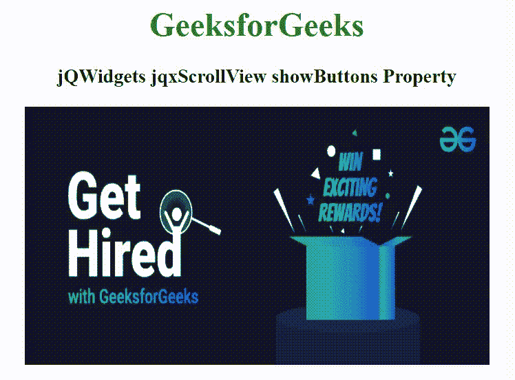

# jQWidgets jqxScrollView showButtons 属性

> 原文：[https://www.geeksforgeeks.org/jqwidgets-jqxscrollview-showbuttons-property/](https://www.geeksforgeeks.org/jqwidgets-jqxscrollview-showbuttons-property/)

`jQWidgets` 是一个 JavaScript 框架，用于为 PC 和移动设备制作基于 web 的应用程序。它是一个非常强大、优化、独立于平台并且得到广泛支持的框架。`jqxScrollView` 是一个 jQuery 小部件，用于查看比设备屏幕上可见区域更宽的内容。可以使用拖动动作或点击/点击 `jqxScrollView` 小部件底部的按钮来选择特定的元素。

`showButtons` 属性用于设置或返回导航按钮是否可见。它接受布尔类型值，默认值为 `true`。

## 语法

*   设置 `showButtons` 属性。

```javascript
$('selector').jqxScrollView({ showButtons: Boolean });
```

*   返回 `showButtons` 属性。

```javascript
var showButtons = $('selector').jqxScrollView('showButtons');
```

## 链接文件

从链接 [https://www.jqwidgets.com/download/](https://www.jqwidgets.com/download/) 下载 `jQWidgets`。在 HTML 文件中，找到下载文件夹中的脚本文件。

```html
<link rel="stylesheet" href="jqwidgets/styles/jqx.base.css" type="text/css">
<script type="text/javascript" src="scripts/jquery-1.11.1.min.js"></script>
<script type="text/javascript" src="jqwidgets/jqxcore.js"></script>
<script type="text/javascript" src="jqwidgets/jqx-all.js"></script>
```

以下示例说明了 `jQWidgets` 中的 `jqxScrollView` `showButtons` 属性。

## 示例

### HTML

```html
<!DOCTYPE html>
<html lang="en">

<head>
    <link rel="stylesheet" 
          href="jqwidgets/styles/jqx.base.css" 
          type="text/css" />
    <script type="text/javascript" 
            src="scripts/jquery-1.11.1.min.js">
    </script>
    <script type="text/javascript" 
            src="jqwidgets/jqxcore.js">
    </script>
    <script type="text/javascript" 
            src="jqwidgets/jqx-all.js">
    </script>
    <script type="text/javascript" 
            src="jqwidgets/jqxscrollview.js">
    </script>

    <style>
        h1,
        h3 {
            text-align: center;
        }

        #jqxSV {
            width: 100%;
            margin: 0 auto;
        }
    </style>
</head>

<body>
    <h1 style="color: green;">
        GeeksforGeeks
    </h1>

    <h3>
        jQWidgets jqxScrollView showButtons Property
    </h3>

    <div id="jqxSV">
        
        
        
        
    </div>

    <script type="text/javascript">
        $(document).ready(function () {
            $('#jqxSV').jqxScrollView({
                width: 450,
                height: 250,
                buttonsOffset: [0, 0],
                showButtons: false
            });
        });
    </script>
</body>

</html>
```

## 输出



## 参考

[https://www.jqwidgets.com/jquery-widgets-documentation/documentation/jqxscrollview/jquery-scrollview-api.htm](https://www.jqwidgets.com/jquery-widgets-documentation/documentation/jqxscrollview/jquery-scrollview-api.htm)