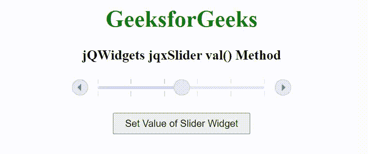

# jQWidgets jqxSlider val()方法

> 原文: [https://www.geeksforgeeks.org/jqwidgets-jqxslider-val-method/](https://www.geeksforgeeks.org/jqwidgets-jqxslider-val-method/)

jQWidgets 是一个 JavaScript 框架，用于为 PC 和移动设备制作基于 web 的应用程序。它是一个非常强大和优化的框架，独立于平台，并得到广泛支持。`jqxSlider` 是一个 jQuery 小部件，可以用来创建一个从一系列值中进行选择的滑块。它在外观方面定制了小部件，并提供了许多配置选项。

`val()`方法用于设置滑块小部件的值。它不接受任何参数，也不返回值。

### 语法:

设置小部件的值。

```javascript
$('Selector').jqxSlider('val');  // or
$('Selector').val(val, value);
```

返回小部件的值。

```javascript
var value = $("Selector").jqxSlider('val');
var value = $("Selector").val();
```

### 链接文件:

从给定的链接 [https://www.jqwidgets.com/download/](https://www.jqwidgets.com/download/) 下载 jQWidgets。在 HTML 文件中，找到下载文件夹中的脚本文件。

```html
<link rel="stylesheet" href="jqwidgets/styles/jqx.base.css" type="text/css">
<link rel="stylesheet" href="jqwidgets/styles/jqx.energyblue.css" type="text/css">
<script type="text/javascript" src="scripts/jquery-1.11.1.min.js"></script>
<script type="text/javascript" src="jqwidgets/jqxc"></script>
```

下面的例子说明了 jQWidgets jqxSlider `val()`方法。

## 超文本标记语言

### 示例:

```html
<!DOCTYPE html>
<html lang="en">

<head>
    <link rel="stylesheet" href=
    "jqwidgets/styles/jqx.base.css" type="text/css" />
    <link rel="stylesheet" href=
    "jqwidgets/styles/jqx.energyblue.css" type="text/css" />
    <script type="text/javascript" 
        src="scripts/jquery-1.11.1.min.js"></script>
    <script type="text/javascript" 
        src="jqwidgets/jqx-all.js"></script>
    <script type="text/javascript" 
        src="jqwidgets/jqxcore.js"></script>
    <script type="text/javascript" 
        src="jqwidgets/jqxbuttons.js"></script>
    <script type="text/javascript" 
        src="jqwidgets/jqxslider.js"></script>
</head>

<body>
    <center>
        <h1 style="color: green;">
            GeeksforGeeks
        </h1>
        <h3>
            jQWidgets jqxSlider val() Method
        </h3>
        <div id="jqxSlider"></div>
        <input type="button" id="jqxBtn" 
            value="Set Value of Slider Widget" 
            style="padding: 5px 15px; margin-top: 20px;">
    </center>

    <script type="text/javascript">
        $(document).ready(function() {
            $('#jqxSlider').jqxSlider({
                theme: 'energyblue',
                value: 5
            });

            $('#jqxBtn').on('click', function() {
                $('#jqxSlider').jqxSlider('val', 8);
            });
        });
    </script>
</body>

</html>
```

### 输出:



### 参考:

[https://www.jqwidgets.com/jquery-widgets-documentation/documentation/jqxslider/jquery-slider-api.htm](https://www.jqwidgets.com/jquery-widgets-documentation/documentation/jqxslider/jquery-slider-api.htm)