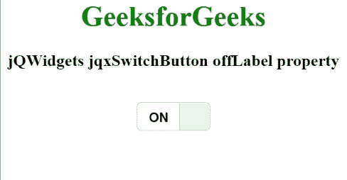

# jQWidgets jqxSwitchButton 的 offLabel 属性

> 原文: [https://www.geeksforgeeks.org/jqwidgets-jqxswitchbutton-offlabel-property/](https://www.geeksforgeeks.org/jqwidgets-jqxswitchbutton-offlabel-property/)

**jQWidgets** 是一个 JavaScript 框架，用于为 PC 和移动设备制作基于 web 的应用程序。它是一个非常强大、优化、独立于平台并且得到广泛支持的框架。`jqxSwitchButton` 用于说明一个 jQuery 按钮小部件，它在被单击后会改变其验证状态。此外，它与 `jqxToggleButton` 完全相同，但拥有独特的用户界面视图。

`offLabel` 属性用于设置或获取显示按钮未选中时显示的字符串。它属于字符串类型，默认值为“关”。

**语法:**

设置 `offLabel` 属性。

```javascript
$('Selector').jqxSwitchButton({ offLabel:'OFF' });
```

获取 `offLabel` 属性。

```javascript
var offLabel = $('Selector').jqxSwitchButton('offLabel');
```

**链接文件:** 从链接下载 [jQWidgets](https://www.jqwidgets.com/download/) 。在 HTML 文件中，找到下载文件夹中的脚本文件。

```html
<link rel="stylesheet" href="jqwidgets/styles/jqx.base.css" type="text/css">
<script type="text/javascript" src="scripts/jquery-1.11.1.min.js"></script>
<script type="text/javascript" src="jqwidgets/jqxcore.js"></script>
<script type="text/javascript" src="jqwidgets/jqxbuttons.js"></script>
```

**示例:** 以下示例说明了 jQWidgets 中的 `jqxSwitchButton` `offLabel` 属性。

## HTML

```html
<!DOCTYPE html>
<html lang="en">
  <head>
    <link
      rel="stylesheet"
      href="jqwidgets/styles/jqx.base.css"
      type="text/css"
    />
    <script type="text/javascript" src="scripts/jquery-1.11.1.min.js"></script>
    <script type="text/javascript" src="jqwidgets/jqxcore.js"></script>
    <script type="text/javascript" src="jqwidgets/jqxbuttons.js"></script>
  </head>
  <body>
    <center>
      <h1 style="color: green">GeeksforGeeks</h1>
      <h3>jQWidgets jqxSwitchButton offLabel property</h3>
      <br />
      <div id="jqxSB"></div>
      <div id="log"></div>
    </center>

    <script type="text/javascript">
      $(document).ready(function () {
        $("#jqxSB").jqxSwitchButton({
          height: "30px",
          width: "80px",
          offLabel: "_off_",
          checked: true,
        });

        $("#jqxSB").on("unchecked", function () {
          var ofl = $("#jqxSB").jqxSwitchButton("offLabel");
          $("#log").html("OFF Label: " + ofl);
        });
      });
    </script>
  </body>
</html>
```

**输出:**



**参考:** [https://www.jqwidgets.com/jquery-widgets-documentation/documentation/jqxbutton/jquery-button-api.htm?search=](https://www.jqwidgets.com/jquery-widgets-documentation/documentation/jqxbutton/jquery-button-api.htm?search=)