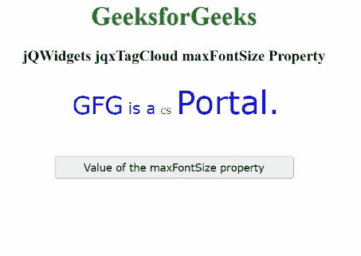

# jqwidgets jqxtagcloud maxfontsize 性质

> 原文: [https://www.geeksforgeeks.org/jqwidgets-jqxtagcloud-maxfontsize-property/](https://www.geeksforgeeks.org/jqwidgets-jqxtagcloud-maxfontsize-property/)

**jQWidgets** 是一个 JavaScript 框架，用于为 PC 和移动设备制作基于 web 的应用程序。它是一个非常强大、优化、独立于平台并且得到广泛支持的框架。`jqxTagCloud` 用于显示一组用户生成的标签，这些标签与网站上的文章、帖子或视频相匹配。

`maxFontSize` 属性用于设置或获取指定 `jqxTagCloud` 值属性最高的标签的字体大小。

**语法:**

*   用于设置 `maxFontSize` 属性。

```javascript
$('#jqxTagCloud').jqxTagCloud({ maxFontSize: 40 });
```

*   获取 `maxFontSize` 属性。

```javascript
var value = $('#jqxTagCloud').jqxTagCloud({ 'maxFontSize' });
```

**链接文件:** 从给定链接下载 [jQWidgets](https://www.jqwidgets.com/download/) 。在 HTML 文件中，找到下载文件夹中的脚本文件。

```html
<link rel="stylesheet" href="jqwidgets/styles/jqx.base.css" type="text/css">
<script type="text/javascript" src="scripts/jquery.js"></script>
<script type="text/javascript" src="jqwidgets/jqxcore.js"></script>
<script type="text/javascript" src="jqwidgets/jqxdata.js"></script>
```

**示例:** 下面的示例说明了 jQWidgets `jqxTagCloud` `maxFontSize` 属性。在下面的例子中， `maxFontSize` 属性的值被设置为 40。

## 超文本标记语言

```html
<!DOCTYPE html>
<html lang="en">

<head>
    <link rel="stylesheet"
          href="jqwidgets/styles/jqx.base.css" 
          type="text/css"/>
    <script type="text/javascript" 
            src="scripts/jquery.js">
    </script>
    <script type="text/javascript" 
            src="jqwidgets/jqxcore.js">
    </script>
    <script type="text/javascript" 
            src="jqwidgets/jqxdata.js">
    </script>
    <script type="text/javascript" 
            src="jqwidgets/jqxtagcloud.js">
    </script>
    <script type="text/javascript" 
            src="jqwidgets/jqx-all.js">
    </script>
</head>

<body>
    <center>
        <h1 style="color:green;">
            GeeksforGeeks
        </h1>
        <h3>
            jQWidgets jqxTagCloud maxFontSize Property
        </h3>
        <div id="Tag_Cloud"></div>
        <input type="button" style="margin:28px;" 
               id="button_for_maxFontSize"
               value="Value of the maxFontSize property"/>
        <div id="log"></div>

        <script type="text/javascript">
            $(document).ready(function () {
                var Data_for_TagCloud = [
                    { Name: "GFG", Rating: 4 },
                    { Name: "is a", Rating: 3 },
                    { Name: "CS", Rating: 2 },
                    { Name: "Portal.", Rating: 5 },
                ];
                var dataAdapter = new
                    $.jqx.dataAdapter({
                        localData: Data_for_TagCloud
                    });
                $('#Tag_Cloud').jqxTagCloud({
                    width: 450,
                    source: dataAdapter,
                    displayMember: 'Name',
                    valueMember: 'Rating',
                    maxFontSize: 40
                });
                $("#button_for_maxFontSize").
                    jqxButton({
                        width: 300
                    });
                $("#button_for_maxFontSize").jqxButton().
                    click(function () {
                        var Value_of_maxFontSize =
                            $('#Tag_Cloud').jqxTagCloud('maxFontSize');
                        $("#log").html((Value_of_maxFontSize));
                    });
            });
        </script>
    </center>
</body>
</html>
```

**输出:**



**参考:** [https://www.jqwidgets.com/jquery-widgets-documentation/documentation/jqxtagcloud/jquery-tagcloud-api.htm?search=](https://www.jqwidgets.com/jquery-widgets-documentation/documentation/jqxtagcloud/jquery-tagcloud-api.htm?search=)