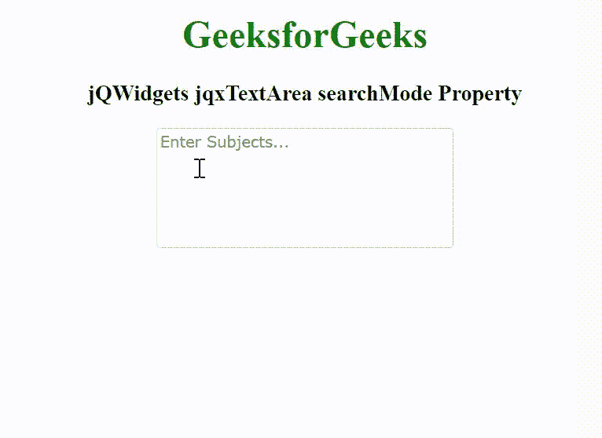

# jQWidgets jqxTextArea searchMode 属性

> 原文：[https://www.geeksforgeeks.org/jqwidgets-jqxtextarea-searchmode-property/](https://www.geeksforgeeks.org/jqwidgets-jqxtextarea-searchmode-property/)

`jQWidgets` 是一个 JavaScript 框架，用于为 PC 和移动设备制作基于 web 的应用程序。它是一个非常强大、优化、独立于平台并且得到广泛支持的框架。`jqxTextArea` 表示一个 jQuery Textarea 小部件，用于在文本框中插入文本内容。

`searchMode` 属性用于设置或返回搜索模式。当用户键入文本区域，并尝试使用输入的文本和选定的搜索模式查找搜索到的项目时，将使用此属性。它接受字符串类型值，其默认值为“默认值”。

`searchMode` 属性的可能值如下。

*   `none`
*   `contains`
*   `containsignorecase`
*   `equals`
*   `equalsignorecase`
*   `startswithignorecase`
*   `startswith`
*   `endswithignorecase`
*   `endswith`

**语法：**

*   设置 `searchMode` 属性。

```javascript
$('selector').jqxTextArea({ searchMode: String });
```

*   返回 `searchMode` 属性。

```javascript
var searchMode = $('selector').jqxTextArea('searchMode');
```

**链接文件：** 从给定链接下载 [jQWidgets](https://www.jqwidgets.com/download/)。在 HTML 文件中，找到下载文件夹中的脚本文件。

```html
<link rel="stylesheet" href="jqwidgets/styles/jqx.base.css" type="text/css" />
<script type="text/javascript" src="scripts/jquery-1.11.1.min.js"></script>
<script type="text/javascript" src="jqwidgets/jqx-all.js"></script>
<script type="text/javascript" src="jqwidgets/jqxcore.js"></script>
<script type="text/javascript" src="jqwidgets/jqxbuttons.js"></script>
<script type="text/javascript" src="jqwidgets/jqxscrollbar.js"></script>
<script type="text/javascript" src="jqwidgets/jqxtextarea.js"></script>
```

**示例：** 以下示例说明了 jQWidgets jqxTextArea `searchMode` 属性。

## HTML

```html
<!DOCTYPE html>
<html lang="en">

<head>
    <link rel="stylesheet" href="jqwidgets/styles/jqx.base.css" type="text/css" />
    <script type="text/javascript" src="scripts/jquery-1.11.1.min.js"></script>
    <script type="text/javascript" src="jqwidgets/jqx-all.js"></script>
    <script type="text/javascript" src="jqwidgets/jqxcore.js"></script>
    <script type="text/javascript" src="jqwidgets/jqxbuttons.js"></script>
    <script type="text/javascript" src="jqwidgets/jqxscrollbar.js"></script>
    <script type="text/javascript" src="jqwidgets/jqxtextarea.js"></script>
</head>

<body>
    <center>
        <h1 style="color: green;">
            GeeksforGeeks
        </h1>
        <h3>
            jQWidgets jqxTextArea searchMode Property
        </h3>
        <textarea id='jqxTA'></textarea>
    </center>

    <script type="text/javascript">
        $(document).ready(function () {
            var data = [
                "Computer Science",
                "C Programming",
                "C++ Programming",
                "Java Programming",
                "Python Programming",
                "HTML",
                "CSS",
                "JavaScript",
                "jQuery",
                "PHP",
                "Bootstrap"
            ];

            $('#jqxTA').jqxTextArea({
                source: data,
                width: 250,
                height: 100,
                placeHolder: 'Enter Subjects...',
                searchMode: 'startswith'
            });
        });
    </script>
</body>

</html>
```

**输出：**



**参考：** [https://www.jqwidgets.com/jquery-widgets-documentation/documentation/jqxtextarea/jquery-textarea-api.htm](https://www.jqwidgets.com/jquery-widgets-documentation/documentation/jqxtextarea/jquery-textarea-api.htm)