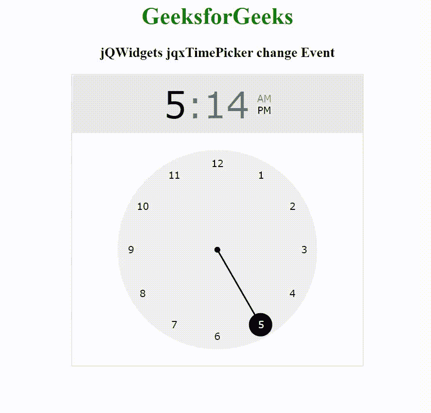

# jQWidgets jqxTimePicker 变更事件

> 原文：[https://www.geeksforgeeks.org/jqwidgets-jqxtimepicker-change-event/](https://www.geeksforgeeks.org/jqwidgets-jqxtimepicker-change-event/)

## 简介

**jQWidgets** 是一个 JavaScript 框架，用于为 PC 和移动设备制作基于 web 的应用程序。它是一个非常强大、优化、独立于平台并且得到广泛支持的框架。`jqxTimePicker` 代表一个 jQuery 小部件，用于以小时和分钟格式选择时间。

当值改变时，基于事件触发，在功能中使用 `change` 事件。

## 语法

```javascript
$("Selector").on("change", function (event) {  });
```

## 链接文件

从给定链接下载 [jQWidgets](https://www.jqwidgets.com/download/)。在 HTML 文件中，找到下载文件夹中的脚本文件。

```html
<link rel="stylesheet" href="jqwidgets/styles/jqx.base.css" type="text/css">
<script type="text/javascript" src="scripts/jquery-1.11.1.min.js"></script>
<script type="text/javascript" src="jqwidgets/jqx-all.js"></script>
<script type="text/javascript" src="jqwidgets/jqxcore.js"></script>
```

## 示例

以下示例说明了 jQWidgets `jqxTimePicker` `change` 事件。

### 超文本标记语言

```html
<!DOCTYPE html>
<html lang="en">

<head>
    <link rel="stylesheet" href=
        "jqwidgets/styles/jqx.base.css" type="text/css" />
    <script type="text/javascript" 
        src="scripts/jquery-1.11.1.min.js"></script>
    <script type="text/javascript" 
        src="jqwidgets/jqx-all.js"></script>
    <script type="text/javascript" 
        src="jqwidgets/jqxcore.js"></script>
    <script type="text/javascript" 
        src="jqwidgets/jqxdraw.js"></script>
    <script type="text/javascript" 
        src="jqwidgets/jqxtimepicker.js"></script>
</head>

<body>
    <center>
        <h1 style="color: green;">
            GeeksforGeeks
        </h1>

        <h3>
            jQWidgets jqxTimePicker change Event
        </h3>

        <div id="jqxTP"></div>
        <p id="res"></p>

    </center>

    <script type="text/javascript">
        $(document).ready(function() {
            $("#jqxTP").jqxTimePicker({
                width: 400,
                height: 400
            });

            $("#jqxTP").on('change', function(event) {
                var value = event.args.value;

                // Get current hour
                var hour = value.getHours();

                // Get current minutes
                var minutes = value.getMinutes();

                $("#res").html("New time: " + hour + ":" + 
                    (minutes < 10 ? "0" + minutes : minutes));
            });
        });
    </script>
</body>

</html>
```

## 输出



## 参考

[https://www.jqwidgets.com/jquery-widgets-documentation/documentation/jqxtimepicker/jquery-timepicker-getting-started.htm](https://www.jqwidgets.com/jquery-widgets-documentation/documentation/jqxtimepicker/jquery-timepicker-getting-started.htm)