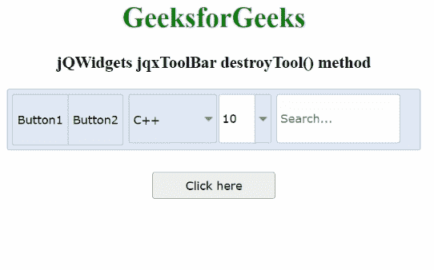

# jQWidgets jqxToolBar destroyTool()方法

> 原文：[https://www.geeksforgeeks.org/jqwidgets-jqxtoolbar-destroytool-method/](https://www.geeksforgeeks.org/jqwidgets-jqxtoolbar-destroytool-method/)

`jQWidgets`是一个JavaScript框架，用于为PC和移动设备制作基于web的应用程序。它是一个非常强大、优化、独立于平台并且得到广泛支持的框架。`jqxToolBar`用于说明一个jQuery小部件，它显示了一个工具栏，各种工具可以自发地添加到其中。此外，`jqxToolBar`偏爱一些小部件，即`jqxButton`、`jqxToggleButton`、`jqxDropDownList`、`jqxComboBox`以及`jqxInput`。但是，也可以附加自定义工具。

`destroyTool()`用于从显示的`jqxToolBar`中销毁工具。它不返回任何东西。

**语法：**

```javascript
$('#Selector').jqxToolBar('destroyTool', index);
```

**参数：**

*   `index`：工具的指定索引。它是数字类型的。

**链接文件：** 从给定链接下载[jQWidgets](https://www.jqwidgets.com/download/)。在HTML文件中，找到下载文件夹中的脚本文件。

```html
<link rel="stylesheet" href="jqwidgets/styles/jqx.base.css" type="text/css" />
<script type="text/javascript" src="scripts/jquery-1.11.1.min.js"></script>
<script type="text/javascript" src="jqwidgets/jqxcore.js"></script>
<script type="text/javascript" src="jqwidgets/jqxbuttons.js"></script>
```

**示例：** 下面的示例说明了`jQWidgets`中的`jqxToolBar` `destroyTool()`方法。

## 示例代码

```html
<!DOCTYPE html>
<html lang="en">

<head>
    <link rel="stylesheet" href=
    "jqwidgets/styles/jqx.base.css" type="text/css" />
    <script type="text/javascript" 
        src="scripts/jquery-1.11.1.min.js"></script>
    <script type="text/javascript" 
        src="jqwidgets/jqxcore.js"></script>
    <script type="text/javascript" 
        src="jqwidgets/jqxbuttons.js"></script>
    <script type="text/javascript" 
        src="jqwidgets/jqxscrollbar.js"></script>
    <script type="text/javascript" 
        src="jqwidgets/jqxlistbox.js"></script>
    <script type="text/javascript" 
        src="jqwidgets/jqxdropdownlist.js"></script>
    <script type="text/javascript" 
        src="jqwidgets/jqxcombobox.js"></script>
    <script type="text/javascript" 
        src="jqwidgets/jqxinput.js"></script>
    <script type="text/javascript" 
    src="jqwidgets/jqxtoolbar.js"></script>
</head>

<body>
    <center>
        <h1 style="color:green">
            GeeksforGeeks
        </h1>

<h3>jQWidgets jqxToolBar destroyTool() method </h3>

<div id="jqxtb"></div>
        <div>
            <input type="button" id="jqxBtn" 
                style="margin-top:25px" 
                value="Click here" />
        </div>
        <br>
        <div id="log"></div>
    </center>

<script type="text/javascript">
        $(document).ready(function () {
            $("#jqxtb").jqxToolBar({
                width: "470px",
                theme: "energyblue",
                height: 70,
                tools: 
"button button | dropdownlist combobox | input",
                initTools:
                    function (type, index, tool, 
                    menuToolIninitialization) {
                        switch (index) {
                            case 0:
                                tool.text("Button1");
                                break;
                            case 1:
                                tool.text("Button2");
                                break;
                            case 2:
                                tool.jqxDropDownList({
                                    width: 100,
                                    source: ["Java", "Scala", "C++"],
                                    selectedIndex: 2
                                });
                                break;
                            case 3:
                                tool.jqxComboBox({
                                    width: 60,
                                    source: [4, 5, 8, 10, 15],
                                    selectedIndex: 3
                                });
                                break;
                            case 4:
                                tool.jqxInput({
                                    width: 140,
                                    placeHolder: "Search..."
                                });
                                break;
                        }
                    }
            });

$("#jqxBtn").jqxButton({
                width: "140px",
                height: "30px",
            });
            $("#jqxBtn").on("click", function () {
                $('#jqxtb').jqxToolBar('destroyTool', 2);
                $('#log').text("Third tool is destroyed!");
            });
        });
    </script>
</body>

</html>
```

**输出：**



**参考：** [https://www.jqwidgets.com/jquery-widgets-documentation/documentation/jqxtoolbar/jquery-toolbar-api.htm?search=](https://www.jqwidgets.com/jquery-widgets-documentation/documentation/jqxtoolbar/jquery-toolbar-api.htm?search=)