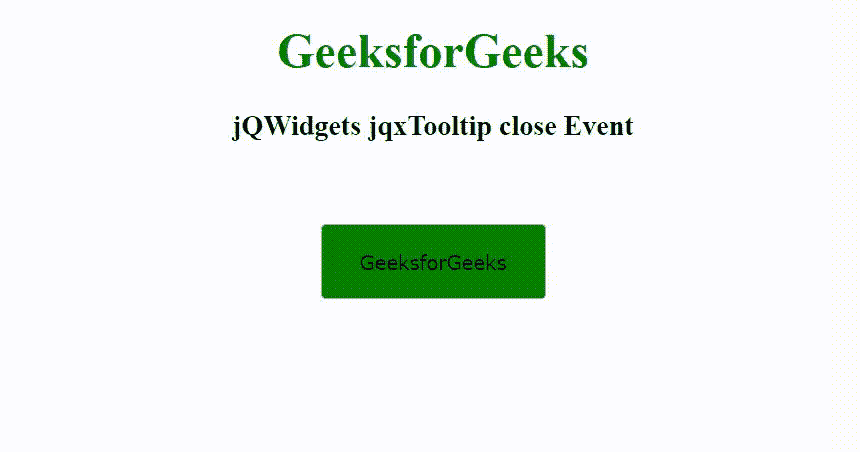

# jqwidgets jqxtoltip close event

> 原文: [https://www.geeksforgeeks.org/jqwidgets-jqxtooltip-close-event/](https://www.geeksforgeeks.org/jqwidgets-jqxtooltip-close-event/)

`jQWidgets` 是一个 JavaScript 框架，用于为 PC 和移动设备制作基于 web 的应用程序。它是一个非常强大、优化、独立于平台并且得到广泛支持的框架。`jqxTooltip` 是一个 jQuery 小部件，用于显示弹出消息。`jqxTooltip` 小部件可以与任何 HTML 元素结合使用。

## close 事件

`close` 事件用于基于工具提示关闭(隐藏)时触发的事件的功能。

### 语法

```javascript
$('Selector').bind('close', function () { });
```

### 链接文件

从给定链接下载 [jQWidgets](https://www.jqwidgets.com/download/)。在 HTML 文件中，找到下载文件夹中的脚本文件。

```html
<link rel="stylesheet" href="jqwidgets/styles/jqx.base.css" type="text/css">
<link rel="stylesheet" href="jqwidgets/styles/jqx.energyblue.css">
<script type="text/javascript" src="scripts/jquery-1.11.1.min.js"></script>
<script type="text/javascript" src="jqwidgets/jqx-all.js"></script>
<script type="text/javascript" src="jqwidgets/jqxcore.js"></script>
<script type="text/javascript" src="jqwidgets/jqxbuttons.js"></script>
<script type="text/javascript" src="jqwidgets/jqxtooltip.js"></script>
```

### 示例

以下示例说明了 `jQWidgets` `jqxTooltip` `close` 事件。

```html
<!DOCTYPE html>
<html lang="en">

<head>
    <link rel="stylesheet" href=
        "jqwidgets/styles/jqx.base.css" type="text/css" />
    <link rel="stylesheet" href=
        "jqwidgets/styles/jqx.energyblue.css">
    <script type="text/javascript" 
        src="scripts/jquery-1.11.1.min.js"></script>
    <script type="text/javascript" 
        src="jqwidgets/jqx-all.js"></script>
    <script type="text/javascript" 
        src="jqwidgets/jqxcore.js"></script>
    <script type="text/javascript" 
        src="jqwidgets/jqxbuttons.js"></script>
    <script type="text/javascript" 
        src="jqwidgets/jqxtooltip.js"></script>
</head>

<body>
    <center>
        <h1 style="color: green;">
            GeeksforGeeks
        </h1>
        <h3>
            jQWidgets jqxTooltip close Event
        </h3>
        <br><br>
        <input type="button" id="jqxBtn" 
            style="background: green;" 
            value="GeeksforGeeks" />
    </center>

    <script type="text/javascript">
        $(document).ready(function() {
            $('#jqxBtn').jqxButton({
                width: 150,
                height: 50
            });

            $("#jqxBtn").jqxTooltip({
                theme: 'energyblue',
                content: 'A computer science portal',
                position: 'top',
                width: 250,
                height: 30
            });

            $('#jqxBtn').bind('close', function () {
                alert('Tooltip Popup Closed');
            });
        });
    </script>
</body>

</html>
```

### 输出



### 参考

[https://www.jqwidgets.com/jquery-widgets-documentation/documentation/jqxtooltip/jquery-tooltip-api.htm](https://www.jqwidgets.com/jquery-widgets-documentation/documentation/jqxtooltip/jquery-tooltip-api.htm)