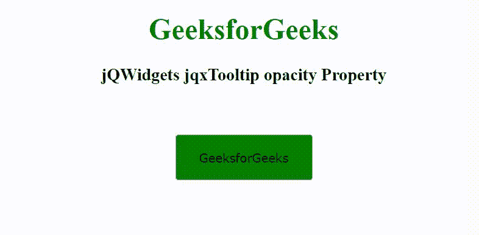

# jqxTooltip opacity 属性

> 原文：[https://www.geeksforgeeks.org/jqwidgets-jqxtooltip-opacity-property/](https://www.geeksforgeeks.org/jqwidgets-jqxtooltip-opacity-property/)

## 介绍

**jQWidgets** 是一个 JavaScript 框架，用于为 PC 和移动设备制作基于 web 的应用程序。这是一个非常强大和优化的框架，独立于平台，并得到广泛支持。`jqxTooltip` 是一个 jQuery 小部件，用于显示弹出消息。`jqxTooltip` 小部件可以与任何 HTML 元素结合使用。

`opacity` 属性用于设置或返回工具提示元素的不透明度。它接受数字类型值，默认值为 0.9。不透明度值必须介于 0 和 1 之间。

## 语法

设置 `opacity` 属性。

```javascript
$('Selector').jqxTooltip({ opacity: Number });
```

返回 `opacity` 属性。

```javascript
var opacity = $('Selector').jqxTooltip('opacity');
```

## 链接文件

从给定链接下载 [jQWidgets](https://www.jqwidgets.com/download/)。在 HTML 文件中，找到下载文件夹中的脚本文件。

```html
<link rel="stylesheet" href="jqwidgets/styles/jqx.base.css" type="text/css">
<link rel="stylesheet" href="jqwidgets/styles/jqx.energyblue.css">
<script type="text/javascript" src="scripts/jquery-1.11.1.min.js"></script>
<script type="text/javascript" src="jqwidgets/jqx-all.js"></script>
<script type="text/javascript" src="jqwidgets/jqxcore.js"></script>
<script type="text/javascript" src="jqwidgets/jqxbuttons.js"></script>
<script type="text/javascript" src="jqwidgets/jqxtooltip.js"></script>
```

## 示例

以下示例说明了 jQWidgets `jqxTooltip` 的 `opacity` 属性。

### HTML

```html
<!DOCTYPE html>
<html lang="en">

<head>
    <link rel="stylesheet" href=
        "jqwidgets/styles/jqx.base.css" type="text/css" />
    <link rel="stylesheet" href=
        "jqwidgets/styles/jqx.energyblue.css">
    <script type="text/javascript" 
        src="scripts/jquery-1.11.1.min.js"></script>
    <script type="text/javascript" 
        src="jqwidgets/jqx-all.js"></script>
    <script type="text/javascript" 
        src="jqwidgets/jqxcore.js"></script>
    <script type="text/javascript" 
        src="jqwidgets/jqxbuttons.js"></script>
    <script type="text/javascript" 
        src="jqwidgets/jqxtooltip.js"></script>
</head>

<body>
    <center>
        <h1 style="color: green;">
            GeeksforGeeks
        </h1>

        <h3>
            jQWidgets jqxTooltip opacity Property
        </h3>
        <br><br>

        <input type="button" id="jqxBtn" 
            style="background: green;" 
            value="GeeksforGeeks" />
    </center>

    <script type="text/javascript">
        $(document).ready(function() {
            $('#jqxBtn').jqxButton({
                width: 150,
                height: 50
            });

            $("#jqxBtn").jqxTooltip({
                theme: 'energyblue',
                content: 'A computer science portal',
                position: 'top',
                width: 200,
                height: 30,
                opacity: 0.4
            });
        });
    </script>
</body>

</html>
```

### 输出



## 参考

[https://www.jqwidgets.com/jquery-widgets-documentation/documentation/jqxtooltip/jquery-tooltip-api.htm](https://www.jqwidgets.com/jquery-widgets-documentation/documentation/jqxtooltip/jquery-tooltip-api.htm)