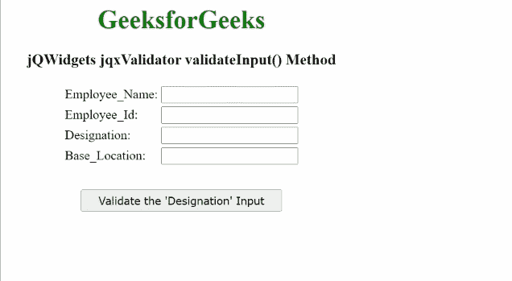

# jQWidgets jqxValidator validateInput()方法

> 原文: [https://www.geeksforgeeks.org/jqwidgets-jqxvalidator-validateinput-method/](https://www.geeksforgeeks.org/jqwidgets-jqxvalidator-validateinput-method/)

`jQWidgets`是一个JavaScript框架，用于为PC和移动设备制作基于web的应用程序。它是一个非常强大、优化、独立于平台并且得到广泛支持的框架。`jqxValidator`用于在JavaScript的帮助下验证HTML表单。根据用户输入验证的要求，它有一些内置规则，如电子邮件、SSN、ZIP、最大值、最小值、间隔等。自定义规则也可以根据具体要求编写。

`validateInput()`方法用于验证指定的`jqxValidator`的单个特定输入。

## 语法

```html
$('#jqxValidator').jqxValidator('validateInput', 'Input');
```

## 参数

该方法接受如下所示的参数。

*   `Input`: 这是正在进行验证的特定输入。

## 返回值

此方法不返回值。

## 链接文件

从给定链接下载[jQWidgets](https://www.jqwidgets.com/download/)。在HTML文件中，找到下载文件夹中的脚本文件。

```html
<link rel="stylesheet" href="jqwidgets/styles/jqx.base.css" type="text/css"/>
<script type="text/javascript" src="scripts/jquery.js"></script>
<script type="text/javascript" src="jqwidgets/jqxcore.js"></script>
<script type="text/javascript" src="jqwidgets/jqxvalidator.js"></script>
```

## 示例

下面的示例说明了`jQWidgets`的`validateInput()`方法。在下面的示例中，只有“指定”输入被验证。

### HTML

```html
<!DOCTYPE html>
<html lang="en">

<head>
    <link rel="stylesheet" 
          href="jqwidgets/styles/jqx.base.css" 
          type="text/css"/>
    <script type="text/javascript" 
            src="scripts/jquery.js">
    </script>
    <script type="text/javascript" 
            src="jqwidgets/jqxcore.js">
    </script>
    <script type="text/javascript" 
            src="jqwidgets/jqx-all.js">
    </script>
    <script type="text/javascript" 
            src="jqwidgets/jqxvalidator.js">
    </script>
</head>

<body>
    <center>
        <h1 style="color:green;">
            GeeksforGeeks
        </h1>
        <h3>
            jQWidgets jqxValidator validateInput() Method
        </h3>
        <form id="Employee_Form">
            <table>
                <tr>
                    <td>Employee_Name:</td>
                    <td>
                        <input type="text" id="Employee_Name"/>
                    </td>
                </tr>
                <tr>
                    <td>Employee_Id:</td>
                    <td>
                        <input type="text" id="Employee_Id"/>
                    </td>
                </tr>
                <tr>
                    <td>Designation:</td>
                    <td>
                        <input type="text" id="Designation"/>
                    </td>
                </tr>
                <tr>
                    <td>Base_Location:</td>
                    <td>
                        <input type="text" id="Base_Location"/>
                    </td>
                </tr>
            </table>
        </form>
        <input type="button" style="margin:28px;" 
               id="button_for_validateInput"
               value="Validate the 'Designation' Input"/>

<script type="text/javascript">
$(document).ready(function () {
    $('#Employee_Form').jqxValidator({
        Rules: [
            {
                input: '#Employee_Name',
                message: 'Employee name is mandatory!',
                rule: 'required'
            },
            {
                input: '#Employee_Id',
                message: 'Employee_Id is mandatory!',
                rule: 'required'
            },
            {
                input: '#Designation',
                message: 'Designation is mandatory!',
                rule: 'required'
            },
            {
                input: '#Base_Location',
                message: 'base location is mandatory!',
                rule: 'required'
            }],
    });

    $("#button_for_validateInput").jqxButton({
        width: 250
    });
    $("#button_for_validateInput").click(
        function () {
            $('#Employee_Form').jqxValidator(
                'validateInput', '#Designation');
        });
});
</script>
    </center>
</body>
</html>
```

### 输出



## 参考

[https://www.jqwidgets.com/jquery-widgets-documentation/documentation/jqxvalidator/jquery-validator-api.htm?search=](https://www.jqwidgets.com/jquery-widgets-documentation/documentation/jqxvalidator/jquery-validator-api.htm?search=)