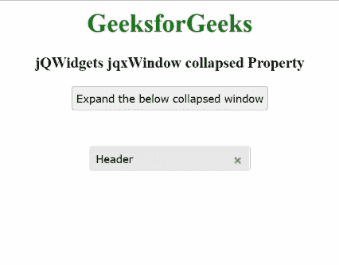

# jQWidgets jqxWindow 折叠属性

> 原文：[https://www.geeksforgeeks.org/jqwidgets-jqxwindow-collapsed-property/](https://www.geeksforgeeks.org/jqwidgets-jqxwindow-collapsed-property/)

**jQWidgets** 是一个 JavaScript 框架，用于为 PC 和移动设备制作基于 web 的应用程序。它是一个非常强大、优化、独立于平台并且得到广泛支持的框架。`jqxWindow` 用于在应用程序中输入数据或查看信息。

`collapsed` 属性用于检查指定窗口是否折叠。

## 语法

设置 `collapsed` 属性。

```javascript
$('#jqxWindow').jqxWindow({ collapsed:true });
```

获取 `collapsed` 属性。

```javascript
var collapsed = $('#jqxWindow').jqxWindow('collapsed');
```

### 链接文件

从给定链接下载 [jQWidgets](https://www.jqwidgets.com/download/)。在 HTML 文件中，找到下载文件夹中的脚本文件。

```html
<link rel="stylesheet" href="jqwidgets/styles/jqx.base.css" type="text/css">
<link rel="stylesheet" href="jqwidgets/styles/jqx.summer.css" type="text/css">
<script type="text/javascript" src="scripts/jquery-1.10.2.min.js"></script>
<script type="text/javascript" src="jqwidgets/jqxcore.js"></script>
```

## 示例

下面的示例说明了 jQWidgets 中的 `jqxWindow` `collapsed` 属性。对于本例，`collapsed` 设置为 `true`。单击“展开下面折叠的窗口”按钮后，折叠的窗口将展开。

### HTML

```html
<!DOCTYPE html>
<html lang="en">

<head>
    <link rel="stylesheet" href=
        "jqwidgets/styles/jqx.base.css" type="text/css" />
    <link rel="stylesheet" href=
        "jqwidgets/styles/jqx.summer.css" type="text/css" />
    <script type="text/javascript" 
        src="scripts/jquery-1.10.2.min.js"></script>
    <script type="text/javascript" 
        src="jqwidgets/jqxcore.js"></script>
    <script type="text/javascript" 
        src="jqwidgets/jqxwindow.js"></script>
    <script type="text/javascript" 
        src="jqwidgets/jqxbuttons.js"></script>

<script type="text/javascript">
        $(document).ready(function () {
            $('#jqxwindow').jqxWindow({
                collapsed: true,
                width: 200,
                height: 100
            });
            $("#jqxbutton").jqxButton({
                height: 30
            });
            $('#jqxbutton').click(function () {
                $("#jqxwindow").jqxWindow('expand');
            });
        });
    </script>
</head>

<body>
    <center>
        <h1 style="color: green;"> GeeksforGeeks </h1>
        <h3> jQWidgets jqxWindow collapsed Property </h3>
        <input type="button" id="jqxbutton" 
            value="Expand the below collapsed window" />
        <div id='content'>
            <div id='jqxwindow'>
                <div> Header</div>
                <div>
                    <div>GeeksforGeeks</div>
                </div>
            </div>
        </div>
    </center>
</body>

</html>
```

## 输出



**参考：**[https://www.jqwidgets.com/jquery-widgets-documentation/documentation/jqxwindow/jquery-window-api.htm?search=](https://www.jqwidgets.com/jquery-widgets-documentation/documentation/jqxwindow/jquery-window-api.htm?search=)