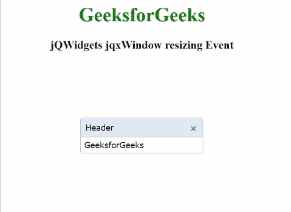

# jQWidgets jqxWindow 调整大小事件

> 原文：[https://www.geeksforgeeks.org/jqwidgets-jqxwindow-resizing-event/](https://www.geeksforgeeks.org/jqwidgets-jqxwindow-resizing-event/)

`jQWidgets` 是一个 JavaScript 框架，用于为 PC 和移动设备制作基于 web 的应用程序。它是一个非常强大、优化、独立于平台并且得到广泛支持的框架。`jqxWindow` 用于在应用程序中输入数据或查看信息。

当最终用户调整窗口大小时，触发 `resizing` 事件。

**语法：**

```javascript
$('#jqxWindow').on('resizing', function (event) {
    // Some code here
}); 
```

**链接文件：** 从给定链接下载 [jQWidgets](https://www.jqwidgets.com/download/)。在 HTML 文件中，找到下载文件夹中的脚本文件。

> <link rel="stylesheet" href="jqwidgets/styles/jqx.base.css" type="text/css">
> <link rel="stylesheet" href="jqwidgets/styles/jqx.summer.css" type="text/css"/>
> <script type="text/javascript" src="scripts/jquery-1.10.2.min.js"></script>
> <script type="text/javascript" src="jqwidgets/jqxcore.js"></script>

下面的例子说明了 `jQWidgets` 中的 `jqxWindow` `resizing` 事件。

## 示例

```html
<html>

<head>
    <link rel="stylesheet" 
          href="jqwidgets/styles/jqx.base.css" 
          type="text/css"/>
    <link rel="stylesheet" 
          href="jqwidgets/styles/jqx.summer.css" 
          type="text/css"/>
    <script type="text/javascript" 
            src="scripts/jquery-1.10.2.min.js">
    </script>
    <script type="text/javascript" 
            src="jqwidgets/jqxcore.js">
    </script>
    <script type="text/javascript" 
            src="jqwidgets/jqxwindow.js">
    </script>
    <script type="text/javascript" 
            src="jqwidgets/jqxbuttons.js">
    </script>
    <script type="text/javascript">
        $(document).ready(function () {
            $('#jqxwindow').jqxWindow({
                theme: 'energyblue'
            });
            $('#jqxwindow').on('resizing',
                               function (event) {
                $("#log").html(
                  "You are resizing a window")
            });
        });
    </script>
</head>

<body>
    <center>
        <h1 style="color: green;">
            GeeksforGeeks
        </h1>
        <h3> 
          jQWidgets jqxWindow resizing Event 
        </h3>
        <div id='jqxwindow'>
            <div> Header</div>
            <div>GeeksforGeeks</div>
        </div>
        <div id="log"></div>
    </center>
</body>

</html>
```

**输出：**



**参考：** [https://www.jqwidgets.com/jquery-widgets-documentation/documentation/jqxwindow/jquery-window-api.htm](https://www.jqwidgets.com/jquery-widgets-documentation/documentation/jqxwindow/jquery-window-api.htm)