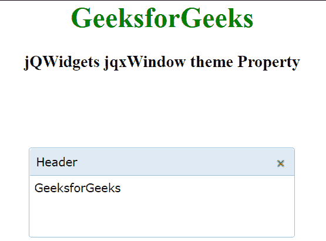

# jQWidgets jqxWindow 主题属性

> 原文: [https://www.geeksforgeeks.org/jqwidgets-jqxwindow-theme-property/](https://www.geeksforgeeks.org/jqwidgets-jqxwindow-theme-property/)

`jQWidgets` 是一个 JavaScript 框架，用于为 PC 和移动设备制作基于 web 的应用程序。它是一个非常强大、优化、独立于平台并且得到广泛支持的框架。`jqxWindow` 用于在应用程序中输入数据或查看信息。

`主题`属性用于设置小部件的主题。

## 语法

```javascript
$('#jqxWindow').jqxWindow({ theme: 'energyblue' });
```

**链接文件:** 从给定链接下载 [jQWidgets](https://www.jqwidgets.com/download/) 。在 HTML 文件中，找到下载文件夹中的脚本文件。

```html
<link rel="stylesheet" href="jqwidgets/styles/jqx.base.css" type="text/css">
<link rel="stylesheet" href="jqwidgets/styles/jqx.energyblue.css" type="text/css">
<script type="text/javascript" src="scripts/jquery-1.10.2.min.js"></script>
<script type="text/javascript" src="jqwidgets/jqxcore.js"></script>
```

**示例:** 下面的示例说明了 `jQWidgets` 中的 `jqxWindow` `主题` 属性。在下面的例子中，`主题`已经被设置为“energyblue”。

## 超文本标记语言

```html
<!DOCTYPE html>
<html lang="en">

<head>
    <link rel="stylesheet" href=
        "jqwidgets/styles/jqx.base.css" type="text/css" />
    <link rel="stylesheet" href=
    "jqwidgets/styles/jqx.energyblue.css" type="text/css" />
    <script type="text/javascript" 
        src="scripts/jquery-1.10.2.min.js"></script>
    <script type="text/javascript" 
        src="jqwidgets/jqxcore.js"></script>
    <script type="text/javascript" 
        src="jqwidgets/jqxwindow.js"></script>
    <script type="text/javascript" 
        src="jqwidgets/jqxbuttons.js"></script>

<script type="text/javascript">
        $(document).ready(function () {
            $("#jqxwindow").jqxWindow({
                width: 300,
                height: 100,
                theme: "energyblue",
            });
        });
    </script>
</head>

<body>
    <center>
        <h1 style="color: green;">
            GeeksforGeeks
        </h1>

<h3>jQWidgets jqxWindow theme Property</h3>

<div id="content">
            <div id="jqxwindow">
                <div>Header</div>
                <div>
                    <div>GeeksforGeeks</div>
                </div>
            </div>
        </div>
    </center>
</body>

</html>
```

## 输出



主题属性

**参考:** [https://www.jqwidgets.com/jquery-widgets-documentation/documentation/jqxwindow/jquery-window-api.htm?search=](https://www.jqwidgets.com/jquery-widgets-documentation/documentation/jqxwindow/jquery-window-api.htm?search=)