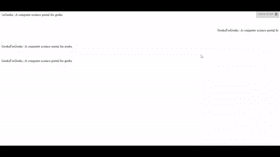
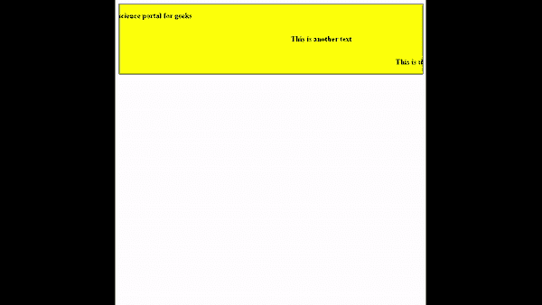

# 使用 JavaScript 创建字幕文本效果

> 原文：[https://www.geeksforgeeks.org/create-the-marquee-text-effect-using-javascript/](https://www.geeksforgeeks.org/create-the-marquee-text-effect-using-javascript/)

在本文中，我们将使用 JavaScript 创建字幕文本效果。使用 `<marquee>` 标签可以达到这个效果，但是该标签已经被**弃用**了，新网站不应使用它。虽然仍有一些浏览器支持这个标签，但为了安全起见，你不应该使用它。下面是该标签如何工作的例子。

**示例：** 在本例中，我们将使用 [HTML 字幕标签](https://www.geeksforgeeks.org/html-marquee-tag/)。

## HTML 代码

```html
<!DOCTYPE html>
<html>
<head>
    <meta charset="utf-8">
    <meta name="viewport" content="width=device-width">
    <title>Marquee tag example</title>
</head>
<body>
    <marquee>
        GeeksForGeeks | A computer science portal for geeks
    </marquee>
    <br><br><br><br>
    <marquee direction="right">
        GeeksForGeeks | A computer science portal for geeks
    </marquee>
    <br><br><br><br>
    <marquee direction="up">
        GeeksForGeeks | A computer science portal for geeks
    </marquee>
    <br><br><br><br>
    <marquee direction="down">
        GeeksForGeeks | A computer science portal for geeks
    </marquee>
</body>
</html>
```

**输出：**



**注意：** 不要在代码内部使用 `marquee` 标签，因为它已被弃用，将来可能会破坏你的代码。

## 使用 JavaScript

为了避免使用被弃用的 `marquee` 标签，可以实现自己的 JavaScript 代码来达到这个效果。首先，我们创建一个 HTML 骨架。创建一个 `div` 标签，在 `div` 标签中创建一些 `<p>` 标签来保存你的文本。

### HTML 代码

```html
<!DOCTYPE html>
<html>
<body>
    <div id="main">
        <p class="para" id="para1">
            Geeksforgeeks |
            A computer science portal for geeks
        </p>
        <p class="para" id="para2">
            This is another text
        </p>
        <p class="para" id="para3">
            This is the third line of the
            example line of the example.
        </p>
    </div>
</body>
</html>
```

### CSS 代码

现在给代码添加一些 CSS。在包装 `div`（所有 `<p>` 标签都位于其中）中，隐藏溢出（这是必要的）并设置你选择的背景颜色、边框、宽度。而在 `<p>` 标签中应该有三个必要属性：`white-space`、`float` 和 `clear`。`white-space` 应设置为 `nowrap`，`float` 为 `left`，同时 `clear` 为 `both`。你还可以添加其他设计属性。

```html
<style>
  #main{
      border: 1px solid;
      background: yellow;
      width: 100%;
      overflow: hidden;
  }
  .para{
      color: black;
      font-weight: bold;
      white-space: nowrap;
      clear: both;
      float: left;
  }
</style>
```

### JavaScript 代码

现在添加移动文本的主要逻辑。我们所做的是减少 `<p>` 元素的 `marginLeft` 属性，当元素变得不可见时，我们再次指定 `marginLeft` 等于 `<p>` 元素的父元素的宽度。以下是实现这个逻辑的步骤：

*   创建一个名为 `elementWidth` 的变量，并指定元素的 `offsetWidth`。
*   创建一个变量名 `parentWidth`，并指定元素的父元素的 `offsetWidth`。
*   创建标志变量 `flag` 并用 `0` 初始化它。
*   创建一个刷新率为 `10` 毫秒的 `setInterval`。
*   每隔一段时间减少 `flag` 值，并将该值设置为 `marginLeft` 属性。
*   如果 `flag` 的负值等于元素的宽度，则将 `marginLeft` 的值设置为等于父元素的宽度。

```javascript
const para1 = document.getElementById("para1");
const para2 = document.getElementById("para2");
const para3 = document.getElementById("para3");

animate(para1);
animate(para2);
animate(para3);

function animate(element) {
    let elementWidth = element.offsetWidth;
    let parentWidth = element.parentElement.offsetWidth;
    let flag = 0;

    setInterval(() => {
        element.style.marginLeft = --flag + "px";

        if (elementWidth == -flag) {
            flag = parentWidth;
        }
    }, 10);
}
```

**输出：** 结合以上三个部分后，我们会看到类似这样的内容。

