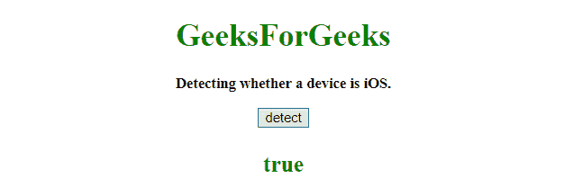

# 使用 JavaScript 检测设备是否是 iOS

> 原文：[https://www.geeksforgeeks.org/detect-a-device-is-ios-or-not-using-javascript/](https://www.geeksforgeeks.org/detect-a-device-is-ios-or-not-using-javascript/)

为了检测一个设备是否是 `iOS`，我们将使用**导航平台**和**导航用户代理**属性。

## Navigator userAgent 属性

此属性返回浏览器发送给服务器的 user-agent 头的值。返回的值包含有关浏览器名称、版本和平台的信息。

**语法：**

```
navigator.userAgent
```

**返回值：**
返回一个字符串，表示当前工作浏览器的用户代理字符串。

## Navigator platform 属性

此属性返回浏览器编译所针对的平台。

**语法：**

```
navigator.platform
```

**返回值：**
返回一个字符串，代表浏览器的平台。可能值包括：

*   Win32
*   Linux i686
*   Linux armv7l
*   Mac 68K
*   Mac PPC
*   SunOS
*   等等。

## 示例 1

本示例通过 `navigator.userAgent` 属性检测设备，并返回 `false`。

```
<!DOCTYPE HTML>
<html>

<head>
    <title>
        JavaScript 
      | Detecting a device is iOS.
    </title>
</head>

<body style="text-align:center;"
      id="body">
    <h1 style="color:green;">  
            GeeksForGeeks  
        </h1>
    <p id="GFG_UP" 
       style="font-size: 15px; 
              font-weight: bold;"> 
      Detecting whether a device is iOS.
    </p>
    <button onclick="gfg_Run()">
        detect
    </button>
    <p id="GFG_DOWN"
       style="color:green; 
              font-size: 23px;
              font-weight: bold;">
    </p>
    <script>
        var el_down = 
            document.getElementById("GFG_DOWN");

        function gfg_Run() {
            var iOS = 
                /iPad|iPhone|iPod/.test(navigator.userAgent) &&
                !window.MSStream;
            el_down.innerHTML = iOS;
        }
    </script>
</body>

</html>
```

**输出：**

*   **点击按钮前：**
    
*   **点击按钮后：**
    

## 示例 2

本例通过 `navigator.platform` 属性检测设备，返回 `true`。

```
<!DOCTYPE HTML>
<html>

<head>
    <title>
        JavaScript 
      | Detecting a device is iOS.
    </title>
</head>

<body style="text-align:center;" 
      id="body">
    <h1 style="color:green;">  
            GeeksForGeeks  
        </h1>
    <p id="GFG_UP" 
       style="font-size: 15px; font-weight: bold;">
      Detecting whether a device is iOS.
    </p>
    <button onclick="gfg_Run()">
        detect
    </button>
    <p id="GFG_DOWN" 
       style="color:green; 
              font-size: 23px; 
              font-weight: bold;">
    </p>
    <script>
        var el_down = 
            document.getElementById("GFG_DOWN");

        function gfg_Run() {
            var iOS = 
                !!navigator.platform &&
                /iPad|iPhone|iPod/.test(navigator.platform);
            el_down.innerHTML = iOS;
        }
    </script>
</body>

</html>
```

**输出：**

*   **点击按钮前：**
    
*   **点击按钮后：**
    

## 示例 3

本例通过 `navigator.platform` 属性检测设备，返回 `false`。

```
<!DOCTYPE HTML>
<html>

<head>
    <title>
        JavaScript 
      | Detecting a device is iOS.
    </title>
</head>

<body style="text-align:center;" 
      id="body">
    <h1 style="color:green;">  
            GeeksForGeeks  
        </h1>
    <p id="GFG_UP" 
       style="font-size: 15px; 
              font-weight: bold;">
      Detecting whether a device is iOS.
    </p>
    <button onclick="gfg_Run()">
        detect
    </button>
    <p id="GFG_DOWN" 
       style="color:green;
              font-size: 23px; 
              font-weight: bold;">
    </p>
    <script>
        var el_down = document.getElementById("GFG_DOWN");

        function gfg_Run() {
            var iOS = 
                !!navigator.platform && 
                /iPad|iPhone|iPod/.test(navigator.platform);
            el_down.innerHTML = iOS;
        }
    </script>
</body>

</html>
```

**输出：**

*   **点击按钮前：**
    
*   **点击按钮后：**
    