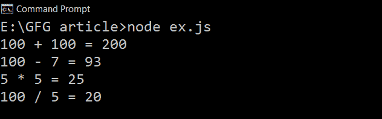

# JavaScript 中一级函数和高阶函数的区别

> 原文：`https://www.geeksforgeeks.org/difference-between-first-class-and-higher-order-functions-in-javascript/`

`一级函数`：如果一种编程语言中的函数被视为其他变量，则称该语言具有`一级函数`。因此，这些函数可以赋给任何其他变量，或者作为参数传递，或者由另一个函数返回。
JavaScript 将函数视为一等公民。这意味着函数只是一个值，只是对象的另一种`类型`。

**举例：** 我们举个例子，多了解一下一级函数。

### JavaScript 代码示例

```javascript
const Arithmetics = {
    add:(a, b) => {
        return `${a} + ${b} = ${a+b}`;
    },
    subtract:(a, b) => {
        return `${a} - ${b} = ${a-b}`
    },
    multiply:(a, b) => {
        return `${a} * ${b} = ${a*b}`
    },
    division:(a, b) => {
        if(b!=0) return `${a} / ${b} = ${a/b}`;
        return `Cannot Divide by Zero!!!`;
    }
}

console.log(Arithmetics.add(100, 100));
console.log(Arithmetics.subtract(100, 7));
console.log(Arithmetics.multiply(5, 5));
console.log(Arithmetics.division(100, 5));
```

**输出：** 在上述程序中，函数作为变量存储在对象中。



`高阶函数`：接收另一个函数作为参数或返回新函数或两者都有的函数称为`高阶函数`。高阶函数是可能的，因为有一级函数。

让我们举一些例子来更好地理解：

**示例 1：** 返回另一个函数的函数。

### JavaScript 代码示例

```javascript
const greet = function(name){
    return function(m){
        console.log(`Hi!! ${name}, ${m}`);
    }
}

const greet_message = greet('ABC');
greet_message("Welcome To GeeksForGeeks")
```

**注意：** 我们也可以这样调用这个函数——`greet('ABC')('Welcome To GeeksForGeeks')`，它也会给出同样的输出。

**输出：**

```
Hi!! ABC, Welcome To GeeksForGeeks
```

**示例 2：** 将函数作为参数传递。

### JavaScript 代码示例

```javascript
function greet(name){
    return `Hi!! ${name} `;
}

function greet_name(greeting,message,name){
       console.log(`${greeting(name)} ${message}`);
}

greet_name(greet,'Welcome To GeeksForGeeks','JavaScript');
```

**注意：** 我们作为参数传递给另一个函数的函数叫做[回调函数](https://www.geeksforgeeks.org/javascript-callbacks/#:~:text=If%20we%20want%20to%20execute,any%20other%20function%20while%20calling.)。

**输出：**

```
Hi!! JavaScript  Welcome To GeeksForGeeks
```

**注：** 函数如 [`filter()`](https://www.geeksforgeeks.org/javascript-array-filter-method/)、[`map()`](https://www.geeksforgeeks.org/javascript-array-map-method/)、[`reduce()`](https://www.geeksforgeeks.org/javascript-array-reduce-method/)、[`some()`](https://www.geeksforgeeks.org/javascript-array-some-method/) 等，这些都是高阶函数的例子。

## 一级函数与高阶函数的主要区别

| 一级函数 | 高阶函数 |
| --- | --- |
| 函数被视为变量，可以赋给任何其他变量或作为参数传递。 | 函数接收另一个函数作为参数，或返回一个新的`一级函数`，或两者兼有。 |
| “一级”这个概念只与编程语言中的函数相关。 | 一般来说，“高阶”的概念可以应用于函数，就像数学意义上的函数一样。 |
| `一级函数`的存在意味着`高阶函数`的存在。 | `高阶函数`的存在并不意味着`一级函数`的存在。 |