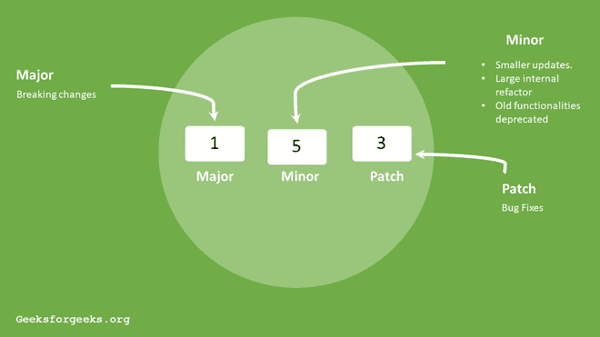

# package.json中波浪号(~)和插入符号(^)之间的差异

> 原文：[https://www.geeksforgeeks.org/difference-between-tilde-and-caret-in-package-json/](https://www.geeksforgeeks.org/difference-between-tilde-and-caret-in-package-json/)

当我们打开`package.json`文件并搜索依赖属性时，我们会在其中找到作为依赖属性列出的嵌套对象：`包名称: 包版本`。现在看包版本，我们发现一些数字用三个点隔开（如`2.6.2`）。

NPM版本是用三个点分开的数字写的，左边第一个数字表示主要版本，左边第二个数字表示次要版本，第三个数字表示软件包的补丁版本。

## NPM版本号格式

NPM版本的语法如下。

```
Major.Minor.Patch
```

## Tilde (~) 表示法

用于匹配最新的补丁版本。波浪号冻结主要版本和次要版本。正如我们所知，补丁更新是错误修复，这就是为什么我们可以说`~`符号允许我们自动接受错误修复。

**示例：**`~1.2.0`将更新所有未来的补丁更新。我们只需要编写`~1.2.0`，所有接下来的补丁更新依赖项，比如`1.2.1`、`1.2.2`、`1.2.5`……`1.2.x`都会被接受。

**注意：**补丁更新是一个包中非常小的安全改动，这就是为什么`~`版本与版本大致相当。

## 插入符号 (^) 符号

用于自动更新次要更新和补丁更新。

**示例：**`^1.2.4`将更新所有未来的次要和补丁更新。例如，如果发生任何更新，`^1.2.4`将自动将依赖关系更改为`1.x.x`。

**使用插入符号，定期查看我们的代码是否与最新版本兼容是很重要的。**



## 区别对比

| 波浪号 (~) 符号 | 插入符号 (^) 符号 |
| :--- | :--- |
| 用于与版本大致相当。 | 用于兼容的版本。 |
| 它将更新到所有未来的补丁版本，但不增加次要版本。`~1.2.3`将使用从`1.2.3`到`< 1.3.0`的版本。 | 它将更新到所有未来的次要/补丁版本，但不增加主要版本。`^2.3.4`将使用从`2.3.4`到`< 3.0.0`的版本。 |
| 它给你一个错误修复版本。 | 它也为你提供向后兼容的新功能。 |
| 在小数位上更新。 | 它会更新到最新的数字版本。 |
| 不是NPM使用的默认符号。 | NPM使用的默认符号。 |
| 示例：`~1.0.2` | 示例：`^1.0.2` |

## 参考文献

[NPM关于语义化版本控制](https://docs.npmjs.com/about-semantic-versioning)