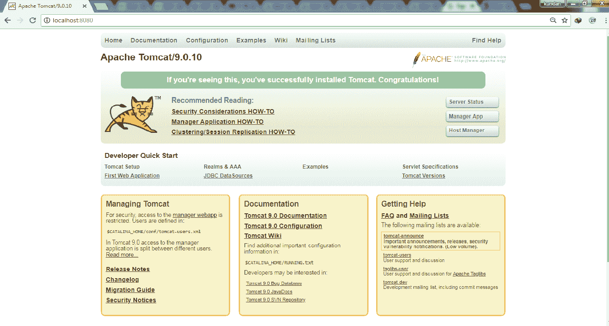

# JSP 的环境设置

> 原文：[https://www.geeksforgeeks.org/environment-setup-for-jsp/](https://www.geeksforgeeks.org/environment-setup-for-jsp/)

JSP 的环境设置主要包括 3 个步骤：

1.  建立 `JDK`。
2.  设置网络服务器（`Tomcat`）。
3.  正在启动 `tomcat` 服务器。

下面详细讨论了所有步骤：

## 1. 设置 Java 开发工具包

**步骤 1：** 此步骤涉及从 [Download JDK.](http://www.oracle.com/technetwork/java/javase/downloads/index.html) 下载 `JDK`。

**步骤 2：** 正确设置 `PATH` 环境变量。对于 `Windows`：

```
右键单击“我的电脑”->
选择“属性”->
单击“高级系统设置”->
单击“环境变量”->
然后，更新 `PATH` 值并按“确定”按钮。
```

在 `LINUX` 系统上，如果 `SDK` 安装在 `/usr/local/jdk-9.0.4` 中，并且您使用了 `C shell`，那么您将在您的 `.cshrc` 文件中更新。

```
setenv PATH /usr/local/jdk-9.0.4/bin:$PATH
setenv JAVA_HOME /usr/local/jdk-9.0.4
```

## 2. 设置 Web 服务器：Tomcat

`Apache Tomcat` 是 `JavaServer Pages` 和 `Servlet` 技术的开源软件实现，可以作为测试 `JSP` 的服务器，可以与 `Apache Web` 服务器集成。

以下是在机器上设置 `Tomcat` 的步骤。

**第一步：** 从[这里](https://tomcat.apache.org/)下载最新版本的 `Tomcat`。

**第二步：** 下载后，将二进制发行版解包到合适的位置。

**步骤 3：** 解包后创建 `CATALINA_HOME` 环境变量，指向相同的位置。

## 3. 启动 Tomcat 服务器

在 **Windows 机器**上使用以下命令启动：

```
%CATALINA_HOME%\bin\startup.bat
```

使用以下命令在 **Linux 机器**上启动：

```
$CATALINA_HOME/bin/startup.sh
```

成功安装并为服务器成功设置路径后。我们可以在你的浏览器上使用 `http://localhost:8080/` 看到 `tomcat` web 服务器的主页。



这是您将在浏览器中看到的最后一页。如果您没有得到所需的结果，那么从 `tomcat` 安装过程重新开始。