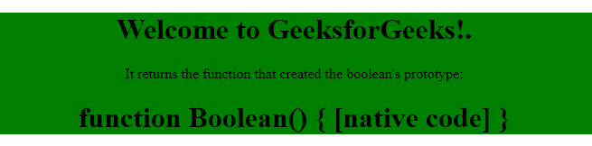

# ES6 Boolean

## 布尔对象的属性

### constructor
`constructor` 属性返回布尔对象的构造函数。对于 ES6 JavaScript `Boolean`，`constructor` 属性返回函数 `Boolean() { [native code] }`。

**语法:**
```
boolean.constructor
```

**返回值:** 返回函数 `Boolean() { [native code] }`。

**示例:**
```html
<!DOCTYPE html>
<html>
<head>
    <title>
        JavaScript Boolean constructor Property
    </title>
</head>
<body style="text-align:center;">
<div style="background-color: green;">
<h1>Welcome to GeeksforGeeks!.</h1>
<p>
            It returns the function that created
            the boolean's prototype:
        </p>
<h1 id="GFG"></h1>
</div>
<!-- Script to use boolean constructor -->
    <script>
        var bool = false;
        document.getElementById("GFG").innerHTML
                = bool.constructor;
    </script>
</body>
</html>
```

**输出:**


### prototype
`Boolean.prototype` 是一个内置属性，用于向所有 `Boolean` 实例添加新属性。有一个构造函数原型，用于向所有 `Boolean` 对象添加属性或方法。

**语法:**
```
Boolean.prototype.name = value
```

**返回值:**
* `Boolean.prototype.valueOf()`: 返回布尔对象的值。
* `Boolean.prototype.toString()`: 根据布尔值返回一个字符串。

**示例:**
```html
<script>
function check(v1) {
        if (v1 == true)
            return (v1 + " is True.");
        else
            return (v1 + " is False.");
    }
// Adding a new property
    Boolean.prototype.myVar = false;
// Adding a new method
    Boolean.prototype.myMethod = check;
// Creating a new boolean object
    var Obj1 = new Boolean();
document.write(Obj1.myMethod(1) + "<br>");
    document.write(Obj1.myMethod(0) + "<br>");
    document.write("myVar = " + Obj1.myVar);
</script>
```

**输出:**
```
1 is True.
0 is False.
myVar = false
```

## 布尔对象的方法

### valueOf() 方法
`Boolean.valueOf()` 方法用于根据指定布尔对象的值返回布尔值 "true" 或 "false"。

**语法:**
```
boolean.valueOf()
```

**返回值:** 如果布尔对象的值为真，则返回 `true`，否则返回 `false`。

**示例:**
```html
<script>
// Here Boolean object obj is created
// for the value true.
var obj = new Boolean(true);
// Here boolean.valueOf() function is
// used for the created object obj.
document.write(obj.valueOf());
</script>
```

**输出:**
```
true
```

### toString() 方法
`Boolean.toString()` 方法用于根据指定布尔对象的值返回字符串 "true" 或 "false"。

**语法:**
```
boolean.toString()
```

**返回值:** 根据指定布尔对象的值，返回一个字符串 "true" 或 "false"。

**示例:**
```html
<script>
// Here Boolean object obj is
// created for the value true.
var obj = new Boolean(true);
// Here boolean.toString() function
// is used for the created object obj.
document.write(obj.toString());
</script>
```

**输出:**
```
true
```

### toSource() 方法
`Boolean.toSource()` 方法用于返回一个表示对象源代码的字符串。

**语法:**
```
boolean.toSource()
```

**返回值:** 返回一个代表对象源代码的字符串。

**示例:**
```html
<script>
// Here Boolean object obj is
// created for the value true.
var obj = new Boolean(true);
// Here boolean.toSource() function
// is used for the created object obj.
document.write(obj.toSource());
</script>
```

**输出:**
```
(new Boolean(true))
```

**注意:** 这个方法并不兼容所有的浏览器。