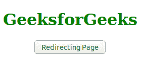
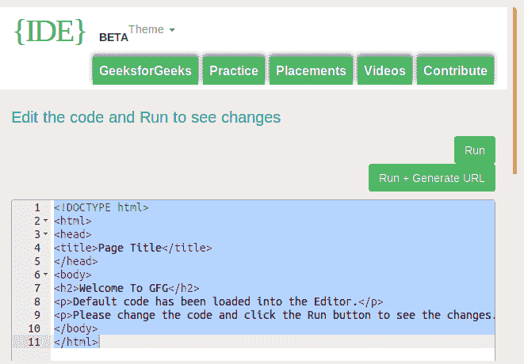

# ES6 页面重定向

> 原文: [https://www.geeksforgeeks.org/es6-page-redirect/](https://www.geeksforgeeks.org/es6-page-redirect/)

**ES6 页面重定向**用于向用户和浏览器搜索引擎发送不同网站地址的请求（搜索引擎和用户收到的网站地址与搜索引擎或用户请求的不同）。重定向到用户或搜索引擎没有请求的不同页面可以在同一服务器上，也可以在不同的服务器上。此外，它可以是一个不同的网站。

重定向到另一个没有被请求的页面是使用 JavaScript 最新版本的 ES6 完成的。有很多方法可以用来重定向到另一个页面，下面列出了所有方法的描述。记住一点，所有的方法都属于一个单窗口返回对象。

## `location.replace()` 方法
此方法将使用 `replace()` 方法将当前网站位置替换为重定向的网站位置。

**语法:**
```
window.location.replace = "*Your redirected link*"
```

## `location.assign()` 方法
该方法将使用 `assign()` 方法为重定向的网站位置分配一个新位置。

**语法:**
```
window.location.assign = "*Your redirected link*"
```

## `location.reload()` 方法
此方法将使用 `reload()` 方法重新加载当前文档。

**语法:**
```
window.location.reload = "*Your redirected link*"
```

## `window.navigate()` 方法
此方法只能在 Internet Explorer 中使用，所有其他浏览器都已移除此方法。因此最好避免使用，因为其他浏览器将不支持此方法。此方法与 `location.assign()` 方法类似。此方法分配一个新值，该值将通过使用 `navigate()` 方法进行导航。

**语法:**
```
window.navigate = "*Your redirected link*"
```

以下示例将说明页面重定向的整个概念:

### 示例
```
<!DOCTYPE html>
<html>
<head>
    <title>
        ES6 | Page Redirect
    </title>
    <script>
        function geeks() {
            window.location =
                "https://ide.geeksforgeeks.org/tryit.php";
        }
    </script>
</head>
<body style="text-align:center;">
    <h1 style="color:green;">
        GeeksforGeeks
    </h1>
    <input type = "button"
        value = "Redirecting Page"
        onclick = "geeks()">
</body>
</html>
```

### 输出
*   **点击按钮前:**
    
*   **点击按钮后:**
    

**注意:** 在网页的头部添加 `rel = "canonical"` ，在使用页面重定向方式时通知搜索引擎。
```
<link rel = "canonical" href = "Redirecting Page" />
```