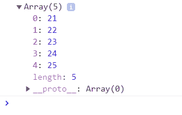
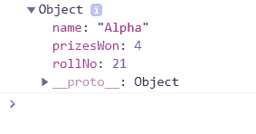
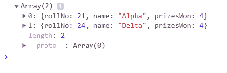

# JavaScript 中的高阶箭头函数

> 原文: [https://www.geeksforgeeks.org/higher-order-arrow-functions-in-javascript/](https://www.geeksforgeeks.org/higher-order-arrow-functions-in-javascript/)

**先决条件:** [箭头功能](https://www.geeksforgeeks.org/arrow-functions-in-javascript/)

高阶函数是接收函数作为参数的函数，否则返回函数作为输出。高阶箭头功能意味着使用箭头功能（在 ES6 中）和高阶功能。

## 高阶箭头功能需求

- 一般来说，程序员指导如何执行功能，而不是什么是需要的，这增加了代码的长度，使其容易出错。
- 而在高阶箭头函数实现中，代码要短得多、简洁、易于调试，并且关注于需要什么而不是如何实现它。
- 我们可以直接用当前值来处理，而不是使用其索引（即 `arr[0]`）单独访问它。
- 不需要创建预定义的数组并推回更改。
- 可以避免对象的突变，不需要维护回路。

### 为什么要避免 `forEach()`？

`forEach()` 函数不返回任何值，因此需要将结果放入预定义的数组中，而 `map()` 函数则不是这种情况。

```javascript
<script>
// Data set of students
var Students = [
    { rollNo: 21, name: 'Alpha' },
    { rollNo: 22, name: 'Beta' },
    { rollNo: 23, name: 'Gamma' },
    { rollNo: 24, name: 'Delta' },
    { rollNo: 25, name: 'Omega'}
];

// Use forEach() function
var StudentRollNo = [];

Students.forEach(function (Student) {
    StudentRollNo.push(Student.rollNo);
});

// Display rollNo data
console.log(StudentRollNo);
</script>
```

**输出:**


高阶函数是：

### 1. `map()` Function

它作用于给定的数组，像*改变/转换*整个数组然后直接返回它。它不会因为少数条件而中断流程。`map()` 函数接受两个参数。第一个是 `callback`，它提供迭代的*当前值*、迭代的 `index`、调用 `map` 的*原始数组*。*另一个参数*不是必需的，它是要在回调中用作 `this` 的值。使用 `map()` 函数的一个缺点是，它的性能只在*小数据集*上表现良好。

```javascript
<script>
// Data set of students
var Students = [
    { rollNo: 21, name: 'Alpha' },
    { rollNo: 22, name: 'Beta' },
    { rollNo: 23, name: 'Gamma' },
    { rollNo: 24, name: 'Delta' },
    { rollNo: 25, name: 'Omega'}
];

// Use map() function
var StudentRollNo = Students.map(function (Student) {
    return Student.rollNo
});

// Display rollNo data
console.log(StudentRollNo);
</script>
```

**输出:**


以上代码的实现使用箭头功能。

```javascript
<script>
// Data set of students
var Students = [
    { rollNo: 21, name: 'Alpha' },
    { rollNo: 22, name: 'Beta' },
    { rollNo: 23, name: 'Gamma' },
    { rollNo: 24, name: 'Delta' },
    { rollNo: 25, name: 'Omega'}
];

// Use map() function with arrow functions
const StudentRollNo = 
    Students.map(Student => Student.rollNo);

// Display Roll no data
console.log(StudentRollNo);
</script>
```

**输出:**


**注:** 更多信息请参考: [JavaScript 中的 map](https://www.geeksforgeeks.org/map-in-javascript/)

### 2. `reduce()` Function

它在为数组的每个元素设置回调方面与 `map()` 函数类似。但不同之处在于，它*reduce*将此回调的结果从原始数组传递到另一个。结果被称为 **accumulator**，它可以是任何东西（`integer`、`character`、`string`、`object`、`map` 等），并且应该在调用时传递。`callback` 现在获取 `accumulator`、`current value`、`index of iteration`、`whole array`。
简单来说，累加器会累积所有返回值。它的值是先前返回的累加值的集合。

```javascript
<script>
// Data set of students
var Students = [
    { rollNo: 21, name: 'Alpha', prizesWon: 1 },
    { rollNo: 22, name: 'Beta', prizesWon: 3 },
    { rollNo: 23, name: 'Gamma', prizesWon: 0 },
    { rollNo: 24, name: 'Delta', prizesWon: 0 },
    { rollNo: 25, name: 'Omega', prizesWon: 1}
];

// Using reduce() function
var totalPrizes = Students.reduce(function (accumulator, Student) {
    return accumulator + Student.prizesWon;
}, 0);

// Display total number of prizes won by all
console.log(totalPrizes);
</script>
```

**输出:**
```
5
```

以上代码的实现使用箭头功能。

```javascript
<script>
// Data set of students
var Students = [
    { rollNo: 21, name: 'Alpha', prizesWon: 1 },
    { rollNo: 22, name: 'Beta', prizesWon: 3 },
    { rollNo: 23, name: 'Gamma', prizesWon: 0 },
    { rollNo: 24, name: 'Delta', prizesWon: 0 },
    { rollNo: 25, name: 'Omega', prizesWon: 1}
];

// Using reduce() function with arrow functions
const totalPrizes = Students.reduce(
    (accumulator, Student) => accumulator + Student.prizesWon, 0);

// Display total number of prizes won by all
console.log(totalPrizes);
</script>
```

**输出:**
```
5
```

### 3. `find()` Function

它也作用于数组，并返回满足函数中给定*条件*的*第一个数组元素*。它与 `map()` 函数类似。尽管它在小数据集上工作良好，但在*大数据集*的情况下，其性能*不是很高*。

```javascript
<script>
// Data set of students
var Students = [
    { rollNo: 21, name: 'Alpha', prizesWon: 4 },
    { rollNo: 22, name: 'Beta', prizesWon: 3 },
    { rollNo: 23, name: 'Gamma', prizesWon: 0 },
    { rollNo: 24, name: 'Delta', prizesWon: 4 },
    { rollNo: 25, name: 'Omega', prizesWon: 1}
];

// Using find() function 
var achievers = Students.find(function (Student) {
    return Student.prizesWon == 4;
});

// Display only first Student who won four prizes
console.log(achievers);
</script>
```

**输出:**


以上代码的实现使用箭头功能。

```javascript
<script>
// Data set of students
var Students = [
    { rollNo: 21, name: 'Alpha', prizesWon: 4 },
    { rollNo: 22, name: 'Beta', prizesWon: 3 },
    { rollNo: 23, name: 'Gamma', prizesWon: 0 },
    { rollNo: 24, name: 'Delta', prizesWon: 4 },
    { rollNo: 25, name: 'Omega', prizesWon: 1}
];

// Using find() function with arrow functions
var achievers = Students.find(
    (Student) => Student.prizesWon == 4);

// Display only first Student who won four prizes
console.log(achievers);
</script>
```

**输出:**


### 4. `filter()` Function

`filter()` 函数作用于数组，并返回一个包含过滤后项的数组，这意味着数组的*长度*被*减少*。它也接收与 `map` 类似的参数，但区别在于回调，因为它需要返回 `true` 或 `false`。如果返回的值是 `true`，则元素保留在数组中，否则元素被过滤掉。

```javascript
<script>
// Data set of students
var Students = [
    { rollNo: 21, name: 'Alpha', prizesWon: 4 },
    { rollNo: 22, name: 'Beta', prizesWon: 3 },
    { rollNo: 23, name: 'Gamma', prizesWon: 0 },
    { rollNo: 24, name: 'Delta', prizesWon: 4 },
    { rollNo: 25, name: 'Omega', prizesWon: 1}
];

// Using filter() function 
var achievers = Students.filter(function (Student) {
    return Student.prizesWon == 4;
});

// Display Students who won four prizes
console.log(achievers);
</script>
```

**输出:**


以上代码的实现使用箭头功能。

```javascript
<script>
// Data set of students
var Students = [
    { rollNo: 21, name: 'Alpha', prizesWon: 4 },
    { rollNo: 22, name: 'Beta', prizesWon: 3 },
    { rollNo: 23, name: 'Gamma', prizesWon: 0 },
    { rollNo: 24, name: 'Delta', prizesWon: 4 },
    { rollNo: 25, name: 'Omega', prizesWon: 1}
];

// Using filter() function with arrow functions
var achievers = Students.filter(
    (Student) => Student.prizesWon == 4);

// Display Students who won four prizes
console.log(achievers);
</script>
```

**输出:**
