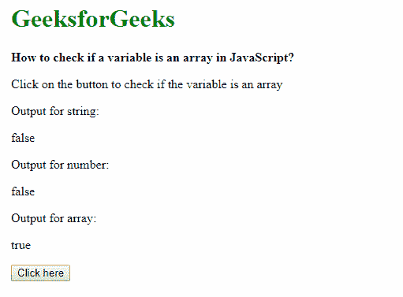

# 如何在 JavaScript 中检查变量是否为数组？

> 原文: [https://www.geeksforgeeks.org/how-to-check-if-a-variable-is-an-array-in-javascript/](https://www.geeksforgeeks.org/how-to-check-if-a-variable-is-an-array-in-javascript/)

在 JavaScript 中，我们可以使用 3 种方法来检查变量是否是数组，使用 `isArray` 方法，使用 `instanceof` 运算符，以及检查 `constructor` 类型是否匹配数组对象。

## 方法 1：使用 isArray 方法

`Array.isArray()` 方法检查传递的变量是否为 `Array` 对象。

**语法：**

```javascript
Array.isArray(variableName)
```

如果变量是数组，则返回 `true` 布尔值，否则返回 `false` 值。这在下面的示例中显示。

**示例-1：**

```html
<!DOCTYPE html>
<html lang="en">

<head>
    <title>
        How to check if a variable
        is an array in JavaScript?
    </title>
</head>

<body>
    <h1 style="color: green">
        GeeksforGeeks
    </h1>
    <b>
        How to check if a variable
        is an array in JavaScript?
    </b>
    <p>
        Click on the button to check
        if the variable is an array
    </p>
    <p>Output for string:
    <div class="outputString">
    </div>

    <p>Output for number:
    <div class="outputNumber">
    </div>

    <p>Output for array:
    <div class="outputArray">
    </div>

    <button onclick="checkArray()">
        Click here
    </button>
    <script type="text/javascript">
        function checkArray() {
            let str = 'This is a string';
            let num = 25;
            let arr = [10, 20, 30, 40];

            ans = Array.isArray(str);
            document.querySelector(
                '.outputString').textContent = ans;

            ans = Array.isArray(num);
            document.querySelector(
                '.outputNumber').textContent = ans;

            ans = Array.isArray(arr);
            document.querySelector(
                '.outputArray').textContent = ans;
        }
    </script>
</body>

</html>
```

**输出：**


## 方法 2：使用 instanceof 运算符

`instanceof` 运算符用于测试构造函数的 `prototype` 属性是否出现在对象的原型链中的任何位置。这可以用来评估给定变量是否具有 `Array` 的原型。

**语法：**

```javascript
variable instanceof Array
```

如果变量与指定的相同（此处为数组），则运算符返回 `true` 布尔值，否则返回 `false` 值。这在下面的示例中显示。

**示例-2：**

```html
<!DOCTYPE html>
<html lang="en">

<head>
    <title>
        How to check if a variable is
        an array in JavaScript?
    </title>
</head>

<body>
    <h1 style="color: green">
        GeeksforGeeks
    </h1>
    <b>
        How to check if a variable is
        an array in JavaScript?
    </b>
    <p>
        Click on the button to check
        if the variable is an array
    </p>
    <p>Output for string:
    <div class="outputString"></div>

    <p>Output for number:
    <div class="outputNumber"></div>

    <p>Output for array:
    <div class="outputArray"></div>

    <button onclick="checkArray()">Click here</button>
    <script type="text/javascript">
        function checkArray() {
            let str = 'This is a string';
            let num = 25;
            let arr = [10, 20, 30, 40];

            ans = str instanceof Array;
            document.querySelector(
                '.outputString').textContent =
                ans;
            ans = num instanceof Array;
            document.querySelector(
                '.outputNumber').textContent =
                ans;
            ans = arr instanceof Array;
            document.querySelector(
                '.outputArray').textContent =
                ans;
        }
    </script>
</body>

</html>
```

**输出：**


## 方法 3：检查变量的 constructor 属性

检查变量是数组的另一种方法是用 `Array` 检查它的 `constructor`。

**语法：**

```javascript
variable.constructor === Array
```

如果变量与指定的相同（这里是一个数组），则为 `true`，否则为 `false`。这在下面的示例中显示。

**示例-3：**

```html
<!DOCTYPE html>
<html lang="en">

<head>
    <title>
        How to check if a variable is
        an array in JavaScript?
    </title>
</head>

<body>
    <h1 style="color: green">
        GeeksforGeeks
    </h1>
    <b>How to check if a variable is
        an array in JavaScript?</b>

    <p>Click on the button to check
        if the variable is an array</p>

    <p>Output for string:
    <div class="outputString"></div>

    <p>Output for number:
    <div class="outputNumber"></div>

    <p>Output for array:
    <div class="outputArray"></div>

    <button onclick="checkArray()">
        Click here
    </button>
    <script type="text/javascript">
        function checkArray() {
            let str = 'This is a string';
            let num = 25;
            let arr = [10, 20, 30, 40];

            ans = str.constructor === Array;
            document.querySelector(
                '.outputString').textContent = ans;

            ans = num.constructor === Array;
            document.querySelector(
                '.outputNumber').textContent = ans;

            ans = arr.constructor === Array;
            document.querySelector(
                '.outputArray').textContent = ans;

        }
    </script>
</body>

</html>
```

**输出：**


JavaScript 最出名的是网页开发，但它也用于各种非浏览器环境。您可以通过以下 [JavaScript 教程](https://www.geeksforgeeks.org/javascript-tutorial/)和 [JavaScript 示例](https://www.geeksforgeeks.org/javascript-examples/)从头开始学习 JavaScript。