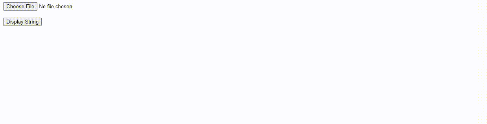

# 如何用 JavaScript 将图像转换成 base64 字符串？

> 原文: [https://www.geeksforgeeks.org/how-to-convert-image-into-base64-string-using-javascript/](https://www.geeksforgeeks.org/how-to-convert-image-into-base64-string-using-javascript/)

## 进场:

*   在这里，我们将创建一个 `gfg.js` 文件，其中将包括或 JavaScript 代码和一个 `gfg.html` 文件。
*   现在我们将把逻辑放在 `input` 类型的 `onchange` 上，当您上传图像时，这将执行函数 `imageUploaded()`。
*   现在，我们将使用 `FileReader`，并在 `FileReader` 中使用 `onload` 事件，之后我们将获得图像 URL，我们需要删除一些文本来获得 base64 字符串，并存储在名为 `base64String` 的变量中，并在控制台上打印。
*   如果你想使用这个 base64，你可以在按钮点击上写逻辑，就像这里，我们将提醒这个 base64 字符串。

## 超文本标记语言

```html
<!DOCTYPE html>
<html lang="en">

<head>
    <script src="gfg.js"></script>
</head>

<body>
    <input type="file" name="" id="fileId" 
        onchange="imageUploaded()">
    <br><br>

    <button onclick="displayString()">
        Display String
    </button>
</body>

</html>
```

## java 描述语言

```javascript
let base64String = "";

function imageUploaded() {
    var file = document.querySelector(
        'input[type=file]')['files'][0];

    var reader = new FileReader();
    console.log("next");

    reader.onload = function () {
        base64String = reader.result.replace("data:", "")
            .replace(/^.+,/, "");

        imageBase64Stringsep = base64String;

        // alert(imageBase64Stringsep);
        console.log(base64String);
    }
    reader.readAsDataURL(file);
}

function displayString() {
    console.log("Base64String about to be printed");
    alert(base64String);
}
```

## 输出:

