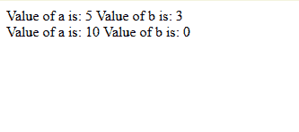
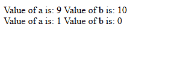

# 如何在 JavaScript 中声明可选的函数参数？

> 原文: [https://www.geeksforgeeks.org/how-to-declare-the-optional-function-parameters-in-javascript/](https://www.geeksforgeeks.org/how-to-declare-the-optional-function-parameters-in-javascript/)

要在 JavaScript 中声明可选的函数参数，有两种方法:

*   **使用逻辑或运算符 (`||`):**
    在这种方法中，可选参数在函数体内与默认值进行逻辑或运算。

**注意:** 可选参数应该总是出现在参数列表的末尾。

### 语法

```
function myFunc(a, b) {
  b = b || 0;
  // b 将被设置为 b 的值或 0。
}
```

### 例 1
在以下程序中，可选参数为 `b`:

```
<script>
    function check(a, b) {
        b = b || 0;
        document.write("Value of a is: " + a +
                       " Value of b is: " + b +
                       "<br>");
    }
    check(5, 3);
    check(10);
</script>
```

### 输出


*   **使用赋值运算符 (`=`):**
    在这种方法中，可选变量在声明语句本身中被赋予默认值。

**注意:** 可选参数应该总是出现在参数列表的末尾。

### 语法

```
function myFunc(a, b = 0) {
   // 函数体
}
```

### 例 2
在以下程序中，可选参数为 `b`:

```
<script>
    function check(a, b = 0) {
        document.write("Value of a is: " + a +
                       " Value of b is: " + b +
                       "<br>");
    }
    check(9, 10);
    check(1);
</script>
```

### 输出
