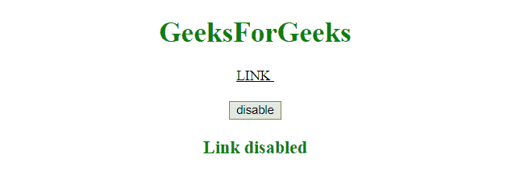

# 如何使用 JavaScript / jQuery 禁用 HTML 链接？

> 原文：[https://www.geeksforgeeks.org/how-to-disable-html-links-using-javascript-jquery/](https://www.geeksforgeeks.org/how-to-disable-html-links-using-javascript-jquery/)

给定一个 HTML 链接，任务是使用 JavaScript/jQuery 禁用该链接。

## 使用 JavaScript 禁用 HTML 链接

*   **`createAttribute()` 方法：** 此方法创建一个具有指定名称的属性，并将该属性作为属性对象返回。

**语法：**

```
document.createAttribute(attrName)
```

**参数：** 该方法接受单参数 `attrName`，该参数为必选项。它指定要创建的属性的名称。

**返回值：** 返回节点对象，表示创建的属性。

*   **`setAttribute()` 方法：** 此方法将指定的属性添加到元素，并赋予其传入的值。如果指定的属性已存在，则设置/更改其值。

**语法：**

```
element.setAttribute(attrName, attrValue)
```

**参数：**

*   `attrName`： 此参数为必选项。它指定要添加的属性的名称。
*   `attrValue`： 此参数为必填项。它指定要添加的属性值。

*   **`setAttributeNode()` 方法：** 此方法将指定的属性节点添加到元素。如果指定的属性已存在，此方法将替换它。

**语法：**

```
element.setAttributeNode(attributeNode)
```

**参数：** 该方法接受单参数 `attributeNode`，这是必需的。它指定要添加的属性节点。

### 示例 1

本示例在 `setAttribute()` 方法的帮助下，将 `disabled` 类添加到 `<a>` 元素中。

```
<!DOCTYPE HTML>
<html>
    <head>
        <title>
            How to disable HTML links
            using JavaScript
        </title>
        <style>
            a.disabled {
                pointer-events: none;
            }
        </style>
    </head>
    <body style = "text-align:center;">
        <h1 style = "color:green;">
            GeeksForGeeks
        </h1>
        <a href = "#" id = "GFG_UP">
            LINK
        </a>
        <br><br>
        <button onclick = "gfg_Run()">
            disable
        </button>
        <p id = "GFG_DOWN" style =
            "color:green; font-size: 20px; font-weight: bold;">
        </p>
        <script>
            var link = document.getElementById('GFG_UP');
            var down = document.getElementById('GFG_DOWN');
            function gfg_Run() {
                link.setAttribute("class", "disabled");
                link.setAttribute("style", "color: black;");
                down.innerHTML = "Link disabled";
            }
        </script>
    </body>
</html>
```

**输出：**

*   **点击按钮前：**
    
*   **点击按钮后：**
    

### 示例 2

本示例在 `setAttributeNode()` 方法的帮助下，通过首先使用 `createAttribute()` 方法创建一个属性，然后将其添加到 `<a>` 元素中，将类 `disabled` 添加到 `<a>` 元素中。

```
<!DOCTYPE HTML>
<html>
    <head>
        <title>
            How to disable HTML links
            using JavaScript
        </title>
        <style>
            a.disabled {
                pointer-events: none;
            }
        </style>
    </head>
    <body style = "text-align:center;">
        <h1 style = "color:green;">
            GeeksForGeeks
        </h1>
        <a href = "#" id = "GFG_UP">
            LINK
        </a>
        <br><br>
        <button onclick = "gfg_Run()">
            disable
        </button>
        <p id = "GFG_DOWN" style =
            "color:green; font-size: 20px; font-weight: bold;">
        </p>
        <script>
            var link = document.getElementById('GFG_UP');
            var down = document.getElementById('GFG_DOWN');
            function gfg_Run() {
                var attr = document.createAttribute("class");
                attr.value = "disabled";
                link.setAttributeNode(attr);
                link.setAttribute("style", "color: black;");
                down.innerHTML = "Link disabled";
            }
        </script>
    </body>
</html>
```

**输出：**

*   **点击按钮前：**
    
*   **点击按钮后：**
    

## 使用 jQuery 禁用 HTML 链接

*   **jQuery `prop()` 方法：** 此方法设置或返回匹配元素的属性和值。如果此方法用于返回属性值，则返回第一个选定元素的值。如果此方法用于设置属性值，则为选定元素集合设置一个或多个属性/值对。

**语法：**

*   **返回属性值：**

```
$(selector).prop(property)
```

*   **设置属性和值：**

```
$(selector).prop(property, value)
```

*   **使用函数设置属性和值：**

```
$(selector).prop(property, function(index, currentvalue))
```

*   **设置多个属性和值：**

```
$(selector).prop({property: value, property: value, ...})
```

**参数：**

*   `property`： 此参数指定属性的名称。
*   `value`： 此参数指定属性的值。
*   `function(index, currentvalue)`： 此参数指定一个返回要设置的属性值的函数。
    *   `index`： 该参数接收集合中元素的索引位置。
    *   `currentvalue`： 此参数接收选定元素的当前属性值。

*   **`addClass()` 方法：** 此方法向指定元素添加一个或多个类名。此方法不会对现有的类属性执行任何操作，它只是向 `class` 属性添加一个或多个类名。

**语法：**

```
$(selector).addClass(className, function(index, currentClass))
```

**参数：**

*   `className`： 此参数为必选项。它指定一个或多个要添加的类名。
*   `function(index, currentClass)`： 此参数可选。它指定一个函数，该函数返回一个或多个要添加的类名。
    *   `index`： 返回元素在集合中的索引位置。
    *   `currentClass`： 返回所选元素的当前类名。

### 示例 1

本示例在 `addClass()` 方法的帮助下，将类 `"disabled"` 添加到 `<a>` 元素中。

```
<!DOCTYPE HTML>
<html>
    <head>
        <title>
            How to disable HTML links
            using jQuery
        </title>
        <script src = "https://ajax.googleapis.com/ajax/libs/jquery/3.4.0/jquery.min.js">
        </script>
        <style>
            a.disabled {
                pointer-events: none;
            }
        </style>
    </head>
    <body style = "text-align:center;">
        <h1 style = "color:green;">
            GeeksForGeeks
        </h1>
        <a href = "#" id = "GFG_UP">
            LINK
        </a>
        <br><br>
        <button onclick = "gfg_Run()">
            disable
        </button>
        <p id = "GFG_DOWN" style =
            "color:green; font-size: 20px; font-weight: bold;">
        </p>
        <script>
            function gfg_Run() {
                $('a').addClass("disabled");
                $('a').css('color', 'black');
                $('#GFG_DOWN').text("Link disabled");
            }
        </script>
    </body>
</html>
```

**输出：**

*   **点击按钮前：**
    
*   **点击按钮后：**
    

### 示例 2

本示例在 `prop()` 方法的帮助下，将类 `"disabled"` 添加到 `<a>` 元素中。

```
<!DOCTYPE HTML>
<html>
    <head>
        <title>
            How to disable HTML links
            using jQuery
        </title>
        <script src = "https://ajax.googleapis.com/ajax/libs/jquery/3.4.0/jquery.min.js">
        </script>
        <style>
            a.disabled {
                pointer-events: none;
            }
        </style>
    </head>
    <body style = "text-align:center;">
        <h1 style = "color:green;">
            GeeksForGeeks
        </h1>
        <a href = "#" id = "GFG_UP">
            LINK
        </a>
        <br><br>
        <button onclick = "gfg_Run()">
            disable
        </button>
        <p id = "GFG_DOWN" style =
            "color:green; font-size: 20px; font-weight: bold;">
        </p>
        <script>
            function gfg_Run() {
                $('a').prop("class", "disabled");
                $('a').css('color', 'black');
                $('#GFG_DOWN').text("Link disabled");
            }
        </script>
    </body>
</html>
```

**输出：**

*   **点击按钮前：**
    
*   **点击按钮后：**
    