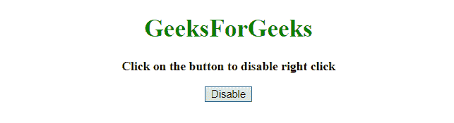
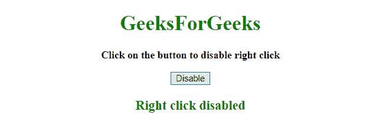
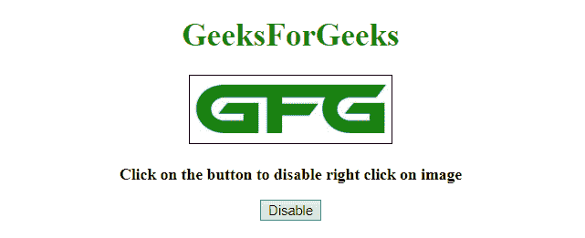
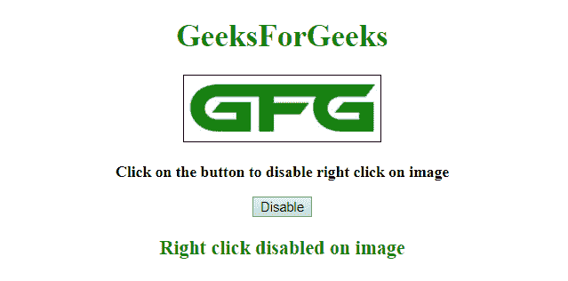

# 如何用 JavaScript 禁用网页右键？

> 原文：[https://www.geeksforgeeks.org/how-to-disable-right-click-on-web-page-using-javascript/](https://www.geeksforgeeks.org/how-to-disable-right-click-on-web-page-using-javascript/)

JavaScript 方法用于禁用页面上的右键单击。使用的方法如下：

*   [`HTML DOM addEventListener() Method`](https://www.geeksforgeeks.org/html-dom-addeventlistener-method/)：此方法将事件处理程序附加到文档。

## 语法

```
document.addEventListener(event, function, useCapture)
```

## 参数

*   `event`：必选参数。它指定作为事件名称的字符串。
*   `function`：必选参数。它指定事件发生时要运行的函数。当事件发生时，事件对象作为第一个参数传递给函数。事件对象的类型取决于定义的事件。例如，“点击”事件属于 `MouseEvent` 对象。
*   `useCapture`：为可选参数。它指定布尔值，该值指示事件应该在捕获阶段还是在冒泡阶段执行。
    *   `true`：指定事件应该在捕获阶段执行。
    *   `false`：指定事件应该在冒泡阶段执行。
*   `preventDefault()` Event Method：此方法取消事件（如果可以取消），意味着它停止属于该事件的默认操作。例如- 点击“提交”按钮时，阻止其提交表单。

## 语法

```
event.preventDefault()
```

**参数：** 不接受任何参数。

## 示例 1

本示例通过为`“上下文菜单”事件`添加事件侦听器并调用`preventDefault()`方法来禁用右键单击。

```
<!DOCTYPE HTML> 
<html> 
    <head> 
        <title> 
            Disable right click on my web page
        </title> 
    </head>

<body style = "text-align:center;">

<h1 style = "color:green;" > 
            GeeksForGeeks 
        </h1>

<p id = "GFG_UP" style = "font-size: 16px; font-weight: bold;"> 
        </p>

<button onclick = "gfg_Run()"> 
            Disable
        </button>

<p id = "GFG_DOWN" style = 
            "color:green; font-size: 20px; font-weight: bold;">
        </p>

<script>
            var el_up = document.getElementById("GFG_UP");
            var el_down = document.getElementById("GFG_DOWN");
            el_up.innerHTML = "Click on the button to disable right click";

function gfg_Run() {
                document.addEventListener('contextmenu', 
                        event => event.preventDefault());
                el_down.innerHTML = "Right click disabled";
            }         
        </script> 
    </body> 
</html>
```

**输出：**

*   **点击按钮前：**
    
*   **点击按钮后：**
    

## 示例 2

本示例通过为`“上下文菜单”事件`添加事件侦听器并调用`preventDefault()`方法来禁用图像上的右键单击。因为，有时我们不希望用户保存图像。

```
<!DOCTYPE HTML> 
<html> 
    <head> 
        <title> 
            Disable right click on my web page
        </title>

<style>
            img {
                border: 1px solid;
            }
        </style> 
    </head>

<body style = "text-align:center;">

<h1 style = "color:green;" > 
            GeeksForGeeks 
        </h1>


<p id = "GFG_UP" style = "font-size: 16px; font-weight: bold;"> 
        </p>

<button onclick = "gfg_Run()"> 
            Disable
        </button>

<p id = "GFG_DOWN" style = 
            "color:green; font-size: 20px; font-weight: bold;">
        </p>

<script>
            var el_up = document.getElementById("GFG_UP");
            var el_down = document.getElementById("GFG_DOWN");
            el_up.innerHTML =
                "Click on the button to disable right click on image";

function gfg_Run() {
                document.addEventListener("contextmenu",

function(e) {
                    if (e.target.nodeName === "IMG") {
                        e.preventDefault();
                    }
                }, false);

el_down.innerHTML = "Right click disabled on image";
            }         
        </script> 
    </body> 
</html>
```

**输出：**

*   **点击按钮前：**
    
*   **点击按钮后：**
    