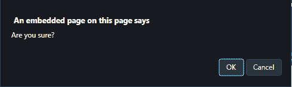

# 使用 JavaScript / jQuery 点击链接时显示确认对话框

> 原文: [https://www.geeksforgeeks.org/how-to-display-confirmation-dialog-when-clicking-an-a-link-using-javascript-jquery/](https://www.geeksforgeeks.org/how-to-display-confirmation-dialog-when-clicking-an-a-link-using-javascript-jquery/)

给定使用 JavaScript 点击 `<a>` 链接时显示确认对话框。

## `onclick` 事件

`onclick` 事件在用户点击元素时发生。

### 语法

**在 HTML 中:**

```html
<element onclick="myScript">
```

**在 JavaScript 中:**

```javascript
object.addEventListener("click", myScript);
```

**在 JavaScript 中，使用 `addEventListener()` 方法:**

```javascript
object.onclick = function() {myScript};
```

## `addEventListener()` 方法

此方法向文档添加事件处理程序。

### 语法

```javascript
document.addEventListener(event, function, useCapture)
```

### 参数

- **`event`**: 此参数为必填项。它指定字符串，即事件的名称。
- **`function`**: 此参数为必选项。它指定事件发生时要运行的函数。当事件发生时，事件对象作为第一个参数传递给函数。类型取决于指定的事件。例如，“点击”事件属于 `MouseEvent` 对象。
- **`useCapture`**: 此参数是可选的。它指定了一个布尔值，这意味着事件应该在捕获阶段还是在冒泡阶段执行。
    - **`true`**: 事件处理程序在捕获阶段执行。
    - **`false`**: 事件处理程序在冒泡阶段执行。

## 示例 1

本示例将 `confirm()` 方法添加到与 `onclick` 事件的链接中。这将验证您是否要继续。

```html
<!DOCTYPE HTML> 
<html> 
    <head> 
        <title> 
            Display a confirmation dialog when
            clicking an a tag link
        </title> 
    </head>

<body style = "text-align:center;">

<h1 style = "color:green;" > 
            GeeksForGeeks 
        </h1>

<p id = "GFG_UP" style =
            "font-size: 15px; font-weight: bold;">
        </p>

<a href="#" onclick="return confirm('Are you sure?')">
            Link
        </a>

<br><br>

<p id = "GFG_DOWN" style = 
            "color:green; font-size: 20px; font-weight: bold;">
        </p>

<script>
            var el_up = document.getElementById("GFG_UP");
            el_up.innerHTML = 
                "Click on the LINK for further confirmation."; 
        </script> 
    </body> 
</html>
```

### 输出

- **点击按钮前:**
    
- **点击按钮后:**
    

## 示例 2

本示例向所有链接添加一个类 `confirm`。之后，它在 `onclick` 事件上将事件监听器添加到该类的元素中。然后调用方法单独处理确认对话框。

```html
<!DOCTYPE HTML> 
<html> 
    <head> 
        <title> 
            Display a confirmation dialog when
            clicking an a tag link
        </title> 
    </head>

<body style = "text-align:center;">

<h1 style = "color:green;" > 
            GeeksForGeeks 
        </h1>

<p id = "GFG_UP" style =
            "font-size: 15px; font-weight: bold;">
        </p>

<a href="#" class="confirm">Link</a>

<br><br>

<p id = "GFG_DOWN" style =
            "color:green; font-size: 20px; font-weight: bold;">
        </p>

<script>
            var el_up = document.getElementById("GFG_UP");
            el_up.innerHTML =
                    "Click on the LINK for further confirmation.";

            var el = document.getElementsByClassName('confirm');
            var confirmThis = function (e) {
                if (!confirm('Are you sure?')) e.preventDefault();
            };

            for (var i = 0, l = el.length; i < l; i++) {
                el[i].addEventListener('click', confirmThis, false);
            }
        </script> 
    </body> 
</html>
```

### 输出

- **点击按钮前:**
    
- **点击按钮后:**
    

# 使用 jQuery 点击 `<a>` 链接时显示确认对话框

## `jQuery on()` 方法

此方法为选定元素和子元素添加一个或多个事件处理程序。

### 语法

```javascript
$(selector).on(event, childSelector, data, function, map)
```

### 参数

- **`event`**: 此参数为必填项。它指定一个或多个要附加到选定元素的事件或命名空间。如果有多个事件值，这些值用空格隔开。事件必须是有效的。
- **`childSelector`**: 该参数可选。它指定事件处理程序应该只附加到已定义的子元素。
- **`data`**: 此参数为可选。它指定要传递给函数的附加数据。
- **`function`**: 此参数为必选项。它指定事件发生时要运行的函数。
- **`map`**: 它指定了一个事件映射 (`{event:func(), event:func(), ...}`)，该事件映射有一个或多个要添加到所选元素的事件，以及事件发生时要运行的函数。

## 示例 1

本示例向 all 链接添加一个类 `confirm`。之后，它在 `onclick` 事件上将事件监听器添加到该类的元素中。然后调用确认对话框。

```html
<!DOCTYPE HTML> 
<html> 
    <head> 
        <title> 
            Display a confirmation dialog when 
            clicking an a tag link
        </title>

<script src =
"https://ajax.googleapis.com/ajax/libs/jquery/3.4.0/jquery.min.js">
        </script>
    </head>

<body style = "text-align:center;">

<h1 style = "color:green;" > 
            GeeksForGeeks 
        </h1>

<p id = "GFG_UP" style =
            "font-size: 15px; font-weight: bold;">
        </p>

<a href="#" class="confirm">Link</a>

<br><br>

<p id = "GFG_DOWN" style = 
            "color:green; font-size: 20px; font-weight: bold;">
        </p>

<script>
            $("#GFG_UP").
                text("Click on the LINK for further confirmation.");

            $('.confirm').on('click', function () {
                return confirm('Are you sure?');
            });
        </script> 
    </body> 
</html>
```

### 输出

- **点击按钮前:**
    
- **点击按钮后:**
    

## 示例 2

本示例将 `confirm()` 方法添加到与 `onclick` 事件的链接中。这将验证您是否要继续。

```html
<!DOCTYPE HTML> 
<html> 
    <head> 
        <title> 
            Display a confirmation dialog when 
            clicking an a tag link
        </title>

<script src =
"https://ajax.googleapis.com/ajax/libs/jquery/3.4.0/jquery.min.js">
        </script>
    </head>

<body style = "text-align:center;">

<h1 style = "color:green;" > 
            GeeksForGeeks 
        </h1>

<p id = "GFG_UP" style = 
            "font-size: 15px; font-weight: bold;">
        </p>

<a href="#" onclick="return confirm('Are you sure?')">
            Link
        </a>

<br><br>

<p id = "GFG_DOWN" style = 
            "color:green; font-size: 20px; font-weight: bold;">
        </p>

<script>
            $("#GFG_UP").
                text("Click on the LINK for further confirmation."); 
        </script> 
    </body> 
</html>
```

### 输出

- **点击按钮前:**
    
- **点击按钮后:**
    

jQuery 是一个开源的 JavaScript 库，它简化了 HTML/CSS 文档之间的交互，它以其“少写多做”的理念而闻名。
跟随本 [jQuery 教程](https://www.geeksforgeeks.org/jquery-tutorials/)和 [jQuery 示例](https://www.geeksforgeeks.org/jquery-examples/)可以从头开始学习 jQuery。