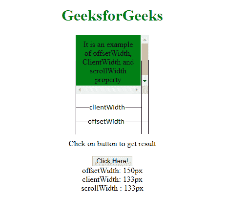

# 如何用普通的 JavaScript 找到 div 的宽度？

> 原文：[https://www.geeksforgeeks.org/how-to-find-the-width-of-a-div-using-vanilla-javascript/](https://www.geeksforgeeks.org/how-to-find-the-width-of-a-div-using-vanilla-javascript/)

为了测量一个 [div](https://www.geeksforgeeks.org/div-tag-html/) 元素的宽度，我们将利用 JavaScript 的 [`offsetWidth`](https://www.geeksforgeeks.org/html-dom-offsetwidth-property/) 属性。JavaScript 的这个属性返回一个表示元素布局宽度的整数，以像素为单位。

## 语法

```html
element.offsetWidth
```

## Return Value

*   Returns the corresponding element’s layout pixel width.

## 例



以下程序将使用 [`offsetWidth`](https://www.geeksforgeeks.org/html-dom-offsetwidth-property/) 说明解决方案：

### 程序 1

```html
<!DOCTYPE html>
<html>
<head>
    <title>
        GeeksforGeeks
    </title>
    <style>
        #GFG {
            height: 30px;
            width: 300px;
            padding: 10px;
            margin: 15px;
            background-color: green;
        }
    </style>
</head>
<body>
    <div id="GFG">
        <b>Division</b>
    </div>
    <button type="button" onclick="Geeks()">
        Check
    </button>
    <script>
        function Geeks() {
            var elemWidth = document.getElementById("GFG").offsetWidth;
            alert(elemWidth);
        }
    </script>
</body>
</html>
```

**输出：**

```html

```

另一种测量 [div](https://www.geeksforgeeks.org/div-tag-html/) 元素宽度的方法，我们将利用 JavaScript 的 [`clientWidth()`](https://www.geeksforgeeks.org/html-dom-clientwidth-property/) 属性。

以下程序将说明使用 [`clientWidth`](https://www.geeksforgeeks.org/html-dom-clientwidth-property/) 的解决方案：

### 程序 2

```html
<!DOCTYPE html>
<html>
<head>
    <title>
        GeeksforGeeks
    </title>
    <style>
        #GFG {
            height: 30px;
            width: 300px;
            padding: 10px;
            margin: 15px;
            background-color: green;
        }
    </style>
</head>
<body>
    <div id="GFG">
        <b>Division</b>
    </div>
    <button type="button" onclick="Geeks()">
        Check
    </button>
    <script>
        function Geeks() {
            var elemWidth = document.getElementById("GFG").clientWidth;
            alert(elemWidth);
        }
    </script>
</body>
</html>
```

**输出：**

```html

```

## 注意

[`clientWidth`](https://www.geeksforgeeks.org/html-dom-clientwidth-property/) 返回包含填充但不包含边框和滚动条的内部宽度，而 [`offsetWidth`](https://www.geeksforgeeks.org/html-dom-offsetwidth-property/) 返回包含填充和边框的外部宽度。