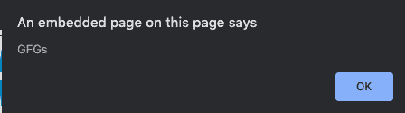
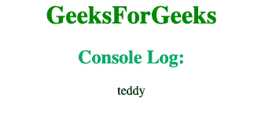

# 如何用 JavaScript 获取当前运行的函数名？

> 原文：[https://www.geeksforgeeks.org/how-to-get-currently-running-function-name-using-javascript/](https://www.geeksforgeeks.org/how-to-get-currently-running-function-name-using-javascript/)

给定一个函数，任务是获取当前使用 JavaScript 运行的函数的名称。

## 方法一：使用 arguments.callee 方法

`arguments.callee` 指向当前正在执行的函数。在此方法中，我们使用 `arguments.callee` 来引用函数名。我们定义一个新变量为 `arguments.callee.toString()`。然后使用 `(variable_name).substr` 来提取函数名并显示它。

### 语法

```
arguments.callee.toString()
```

你可能需要解析这个名字，因为它可能会包含一些额外的垃圾信息。

### 示例 1

本示例使用 `arguments.callee` 方法显示当前运行的函数。

```
<!DOCTYPE HTML>
<html>

<head> 
    <title> 
        How to get currently running
        function name using JavaScript ?
    </title> 
</head>

<body style = "text-align:center;">

<h1 style = "color:green;" > 
        GeeksForGeeks 
    </h1>

<script> 
        function GFGs() {
            var me = arguments.callee.toString();
            me = me.substr('function '.length);     
            me = me.substr(0, me.indexOf('('));     
            alert(me);
        }
        GFGs();         
    </script> 
</body>

</html>
```

**输出：**


## 方法二：使用 console.log 方法

借助 `console.log` 方法，我们定义一个新函数，该函数返回当前正在执行的函数的名称。

### 语法

```
function getFuncName() {
    return getFuncName.caller.name
}
function teddy() { 
    console.log(getFuncName())
}
teddy()
```

### 示例 2

本示例使用 `console.log` 方法显示当前运行的函数。

```
<!DOCTYPE html>
<html>

<head>
    <title> 
        How to get currently running
        function name using JavaScript ?
    </title> 
</head>

<body style = "text-align:center;">

<h1 style = "color:green;" > 
        GeeksForGeeks 
    </h1>

<script> 
        function getFuncName() {
            return getFuncName.caller.name
        }

        function teddy() { 
            console.log(getFuncName())
        }
        teddy()     
    </script> 
</body>

</html>
```

**输出：**
