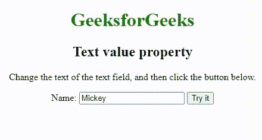
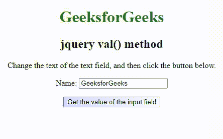

# 如何用 JavaScript 获取文本输入字段的值？

> 原文：[https://www.geeksforgeeks.org/how-to-get-the-value-of-text-input-field-using-javascript/](https://www.geeksforgeeks.org/how-to-get-the-value-of-text-input-field-using-javascript/)

我们可以使用 JavaScript 中的各种方法获得文本输入字段的值。有一个文本值属性，可以设置和返回文本字段的 `value` 属性的值。另外，我们可以使用脚本内部的 jQuery `val()` 方法来获取或设置文本输入字段的值。

以下是获取或设置文本输入字段值的两种不同方法：

## 使用文本值属性

文本值属性用于设置或返回输入字段的 `value` 属性的值。`value` 属性指定输入文本字段的初始值。它包含默认值或用户输入的类型。

**语法：**

```
Get value : textObject.value
Set value : textObject.value = text
```

**示例 1：** 本示例使用 Text value 属性从输入文本字段中获取值。

### HTML

```html
<!DOCTYPE html>
<html>

<body style="text-align:center;">
    <h1 style="color:green;">   
            GeeksforGeeks   
    </h1>
    <h2>Text value property</h2>
    <p>
        Change the text of the text field, 
        and then click the button below. 
    </p>

Name:<input type="text" id="myText" value="Mickey">
    <button type="button" onclick="myFunction()">Try it</button>
    <p id="demo"></p>

<script>
// Here the value is stored in new variable x 
    function myFunction() {
        var x = document.getElementById("myText").value;
        document.getElementById("demo").innerHTML = x;
    }
    </script>
</body>

</html>
```

**输出：**



## 使用 jQuery val() 方法

使用 `val()` 方法返回或设置所选元素的 `value` 属性。在默认模式下，该方法返回第一个匹配元素的 `value` 属性值，并为所有匹配元素设置 `value` 属性值。

**语法：**

```
Get value : $(selector).val()
Set value : $(selector).val(value)
```

**示例 2：** 本示例描述了从输入字段中获取值的 jQuery `val()` 方法。

### HTML

```html
<!DOCTYPE html>
<html>

<head>
    <script src=
"https://ajax.googleapis.com/ajax/libs/jquery/3.3.1/jquery.min.js">
    </script>
    <script>
    $(document).ready(function() {
        $("button").click(function() {
// Here the value is stored in variable. 
            var x = $("input:text").val();
            document.getElementById("demo").innerHTML = x;
        });
    });
    </script>
</head>

<body style="text-align:center;">
    <h1 style="color:green;">   
            GeeksforGeeks   
        </h1>
    <h2>jquery val() method</h2>
    <p>
     Change the text of the text field, and 
     then click the button below.
    </p>

<p>Name:<input type="text" name="user" 
                   value="GeeksforGeeks">
     </p>

<button>Get the value of the input field</button>
    <p id="demo"></p>

</body>

</html>
```

**输出：**

