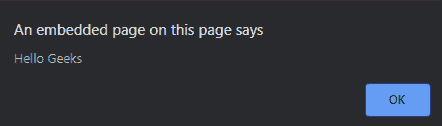

# 如何在另一个 JavaScript 文件中包含一个 JavaScript 文件？

> 原文: [https://www.geeksforgeeks.org/how-to-include-a-javascript-file-in-another-javascript-file/](https://www.geeksforgeeks.org/how-to-include-a-javascript-file-in-another-javascript-file/)

在引入 ES6 模块之前的原生 JavaScript 中，没有导入、包含或要求功能。在此之前，我们可以使用 DOM 中的 `script` 标签将一个 JavaScript 文件加载到另一个 JavaScript 文件中，该脚本将立即下载并执行。

现在，在 ES6 模块发明之后，已经开发了许多不同的方法来解决这个问题，下面将对此进行讨论。

## ES6 模块

从 v8.5 开始，Node.js 中就支持 ECMAScript (ES6) 模块，在这个模块中，我们在一个文件中定义导出的函数，在另一个文件中导入。

从另一个函数调用 JavaScript 文件有两种常用方法，如下所示：

*   Ajax 技术
*   连接文件

### Ajax 技术示例

*   **外部 JavaScript 文件命名为 `main.js`**

```javascript
// This alert will export in the main file
alert("Hello Geeks")
```

*   **主文件:** 该文件将导入上述 `main.js` 文件

```html
<!DOCTYPE html>
<html>
<head>
    <title>
        Calling JavaScript file from
        another JavaScript file
    </title>
    <script type="text/javascript">
        var script = document.createElement('script');
        script.src = "https://media.geeksforgeeks.org/wp-content/uploads/20190704153043/main.js";
        document.head.appendChild(script)
    </script>
</head>
<body>
</body>
</html>
```

*   **输出:**
    

### 连接文件示例

这里将多个 JavaScript 文件导入到单个 JavaScript 文件中，并从函数调用该主 JavaScript 文件。

*   **外部 JavaScript 文件命名为 `main.js`**

```javascript
// This alert will export in the main file
alert("Hello Geeks")
```

*   **外部 JavaScript 文件 `second.js`**

```javascript
// This alert will export in the main file
alert("Welcome to Geeksforgeeks")
```

*   **外部 JavaScript 文件 `master.js`**

```javascript
function include(file) {
    var script = document.createElement('script');
    script.src = file;
    script.type = 'text/javascript';
    script.defer = true;
    document.getElementsByTagName('head').item(0).appendChild(script);
}

/* Include Many js files */
include('https://media.geeksforgeeks.org/wp-content/uploads/20190704153043/main.js');
include('https://media.geeksforgeeks.org/wp-content/uploads/20190704162640/second.js');
```

*   **主文件:** 该文件将导入上述 `master.js` 文件

```html
<!DOCTYPE html>
<html>
<head>
    <title>
        Calling JavaScript file from
        another JavaScript file
    </title>
    <script type="text/javascript" src="https://media.geeksforgeeks.org/wp-content/uploads/20190704162730/master.js">
    </script>
</head>
<body>
</body>
</html>
```

*   **输出:**
    `main.js` 文件导入:
    
    `second.js` 文件导入:
    