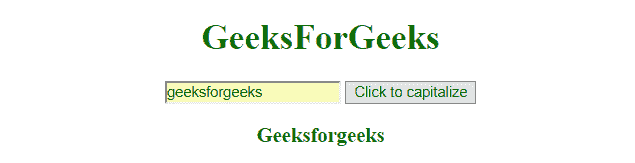
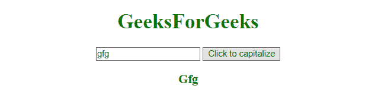

# 如何在 JavaScript 中将字符串的首字母大写？

> 原文：[https://www.geeksforgeeks.org/how-to-make-first-letter-of-a-string-uppercase-in-javascript/](https://www.geeksforgeeks.org/how-to-make-first-letter-of-a-string-uppercase-in-javascript/)

在 `JavaScript` 中，有多种方法可以将字符串的第一个字母大写。以下是一些方法：

## 1. `toUpperCase()`
此函数应用于字符串，并将所有字母转换为大写。
**语法：**
```javascript
string.toUpperCase()
```
**返回值：** 该函数返回大写字符串。

## 2. `slice()`
此函数应用于字符串，并根据传递的参数对其进行切片。
**语法：**
```javascript
string.slice(start, end)
```
- **`start`**：此参数为必填项。它指定开始切片的位置。索引从位置 0 开始。
- **`end`**：此为可选参数。它指定从哪里开始结束切片的位置（不包括结束）。如果省略此参数，它将从开始选择所有字符。

**返回值：** 该函数返回切片后的字符串。

## 3. `charAt()`
`charAt()` 函数返回字符串中给定位置的字符。
**语法：**
```javascript
string.charAt(index)
```
**返回值：** 此函数返回字符串中指定位置的字符。

## 4. `replace()`
这是 JavaScript 中的一个内置函数，用于将字符串的一部分替换为另一个字符串或正则表达式。原始字符串不会受到影响。
**语法：**
```javascript
str.replace(A, B)
```
**参数：** 这里的参数 `A` 是正则表达式，`B` 是将替换给定字符串内容的字符串。
**返回值：** 返回一个有替换项的新字符串。

**示例 1：**
```html
<!DOCTYPE html>
<html>
    <head>
        <title></title>
    </head>
    <body style="text-align:center;">
        <h1 style="color:green;">
            GeeksForGeeks
        </h1>
        <input id="input" type="text" name="input"/>
        <button onclick="capitalizeFLetter()">
            Click to capitalize
        </button>
        <h3 id="div" style="color: green">
        </h3>
        <script>
            function capitalizeFLetter() {
                var input = document.getElementById("input");
                var x = document.getElementById("div");
                var string = input.value;
                x.innerHTML = string[0].toUpperCase() +
                    string.slice(1);
            }
        </script>
    </body>
</html>
```
**输出：**
- **点击按钮前：**
    
- **点击按钮后：**
    

**示例 2：** 本示例使用 `slice()` 方法使字符串的第一个字母大写。
```html
<!DOCTYPE html>
<html>
    <head>
        <title></title>
    </head>
    <body style="text-align:center;">
        <h1 style="color:green;">
            GeeksForGeeks
        </h1>
        <input id="input" type="text" name="input"/>
        <button onclick="capitalizeFLetter()">
            Click to capitalize
        </button>
        <h3 id="div" style="color: green">
        </h3>
        <script>
            function capitalizeFLetter() {
                var input = document.getElementById("input");
                var x = document.getElementById("div");
                var string = input.value;
                x.innerHTML = string.charAt(0).toUpperCase() +
                    string.slice(1);
            }
        </script>
    </body>
</html>
```
**输出：**
- **点击按钮前：**
    
- **点击按钮后：**
    

**示例 3：** 本示例使用 `string.replace()` 方法将字符串的第一个字母大写。
```html
<!DOCTYPE html>
<html>
    <head>
        <title></title>
    </head>
    <body style="text-align:center;">
        <h1 style="color:green;">
            GeeksForGeeks
        </h1>
        <input id="input" type="text" name="input"/>
        <button onclick="capitalizeFLetter()">
            Click to capitalize
        </button>
        <h3 id="div" style="color: green">
        </h3>
        <script>
            function capitalizeFLetter() {
                var input = document.getElementById("input");
                var x = document.getElementById("div");
                var string = input.value;
                x.innerHTML =
                    string.replace(/^./, string[0].toUpperCase());
            }
        </script>
    </body>
</html>
```
**输出：**
- **点击按钮前：**
    
- **点击按钮后：**
    