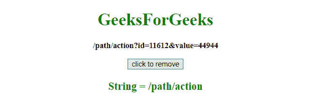

# 如何在 JavaScript 中删除某个字符后的部分字符串？

> 原文：[https://www.geeksforgeeks.org/how-to-remove-portion-of-a-string-after-certain-character-in-javascript/](https://www.geeksforgeeks.org/how-to-remove-portion-of-a-string-after-certain-character-in-javascript/)

给定一个网址，任务是使用 JavaScript 删除某个字符后的一部分网址。

## 方法介绍

### `split()` 方法
此方法用于将字符串拆分为子字符串数组，并返回新数组。

**语法：**
```
string.split(separator, limit)
```

**参数：**
*   `separator`：为可选参数。它指定用于拆分字符串的字符或正则表达式。如果不使用，将返回整个字符串（只有一项的数组）。
*   `limit`：为可选参数。它指定指定拆分次数的整数，超出拆分限制的项目将从数组中排除。

**返回值：** 返回一个新数组，包含拆分后的项目。

### `JavaScript String substring()` 方法
此方法获取字符串中两个定义索引之间的字符，并返回新的子字符串。此方法获取字符串中“start”和“end”之间的字符，不包括“end”本身。

**语法：**
```
string.substring(start, end)
```

**参数：**
*   `start`：为必输参数。它指定开始提取的位置。第一个字符的索引从 0 开始。
*   `end`：为可选参数。它指定停止提取的位置（不包括）。如果不使用，它将提取整个字符串。

**返回值：** 返回包含提取字符的新字符串。

## 示例

### 示例 1
本示例使用 `substring()` 方法删除字符串中特定字符（?）。

```html
<!DOCTYPE HTML>
<html>
    <head>
        <title>
            Remove portion of string after
            certain characters
        </title>
    </head>

<body style = "text-align:center;">

<h1 style = "color:green;" >
            GeeksForGeeks
        </h1>

<p id = "GFG_UP" style = "font-size: 15px; font-weight: bold;">
        </p>

<button onclick = "GFG_click()">
            click to remove
        </button>

<p id = "GFG_DOWN" style =
            "color:green; font-size: 20px; font-weight: bold;">
        </p>

<script>
            var el_up = document.getElementById("GFG_UP");
            var el_down = document.getElementById("GFG_DOWN");
            var s = '/path/action?id=11612&value=44944';
            el_up.innerHTML = s;

function GFG_click() {
                s = s.substring(0, s.indexOf('?'));
                el_down.innerHTML = "String = "+s;
            }
        </script>
    </body>
</html>
```

**输出：**
*   **点击按钮前：**
    
*   **点击按钮后：**
    

### 示例 2
本示例使用 `split()` 方法删除字符串中某个字符（?）。

```html
<!DOCTYPE HTML>
<html>
    <head>
        <title>
            Remove portion of string after
            certain character
        </title>
    </head>

<body style = "text-align:center;">
        <h1 style = "color:green;" >
            GeeksForGeeks
        </h1>

<p id = "GFG_UP" style = "font-size: 15px; font-weight: bold;">
        </p>

<button onclick = "GFG_click()">
            click to remove
        </button>

<p id = "GFG_DOWN" style =
            "color:green; font-size: 20px; font-weight: bold;">
        </p>

<script>
            var el_up = document.getElementById("GFG_UP");
            var el_down = document.getElementById("GFG_DOWN");
            var s = '/path/action?id=11612&value=44944';
            el_up.innerHTML = s;

function GFG_click() {
                s = s.split('?')[0]
                el_down.innerHTML = "String = " + s;
            }
        </script>
    </body>
</html>
```

**输出：**
*   **点击按钮前：**
    
*   **点击按钮后：**
    