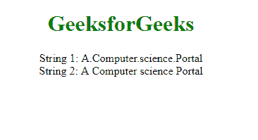
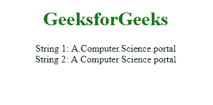

# 如何用 JavaScript 替换字符串中的所有点？

> 原文: [https://www.geeksforgeeks.org/how-to-replace-all-dots-in-a-string-using-javascript/](https://www.geeksforgeeks.org/how-to-replace-all-dots-in-a-string-using-javascript/)

有一些方法可以替换字符串中的**点(.)**。

## replace()

`string.replace()` 函数用于*将给定字符串的一部分替换为另一个字符串或正则表达式*。原始字符串将保持不变。

### 语法

```
str.replace(A, B)
```

### 示例-1

我们正在将文本“计算机科学门户”中的圆点(.)替换为空格( )。

```html
<!DOCTYPE html>
<html>
<head>
</head>
<body>
    <center>
        <h1 style="color:green">
            GeeksforGeeks
        </h1>
        <script>
            // Assigning a string
            var str = 'A.Computer.science.Portal';

            // Calling replace() function
            var res = str.replace(/\./g, ' ');

            // Printing original string
            document.write("String 1: " + str);

            // Printing replaced string
            document.write("<br>String 2: " + res);
        </script>
    </center>
</body>
</html>
```

### 输出



## Split() and Join()

我们可以使用 JavaScript 的 `split` 方法拆分文本字符串，并使用 `join` 方法用替换字符连接字符串。

### 语法

```
string.split('.').join(' ');
```

### 示例-2

我们正在使用拆分和连接将圆点(.)替换为空格( )。

```html
<!DOCTYPE html>
<html>
<head>
</head>
<body>
    <center>
        <h1 style="color:green">GeeksforGeeks</h1>
        <script>
            // Assigning a string
            let str = 'A.Computer.Science.portal';

            // Calling split(), join() function
            let newStr = str.split('.').join(' ');

            // Printing original string
            document.write("String 1: " + str);

            // Printing replaced string
            document.write("<br>String 2: " + newStr);
        </script>
    </center>
</body>
</html>
```

### 输出

