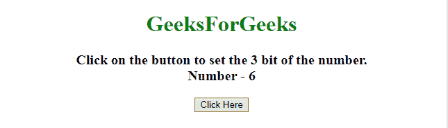
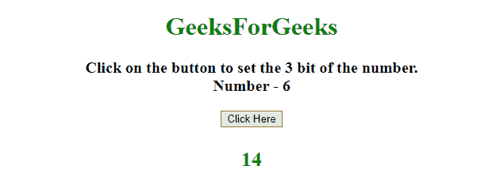
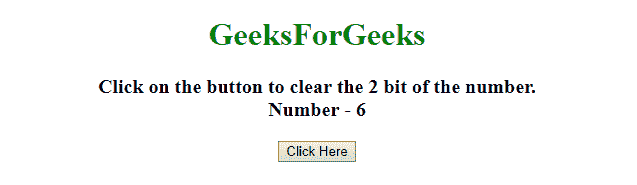
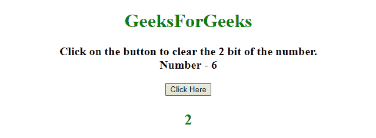
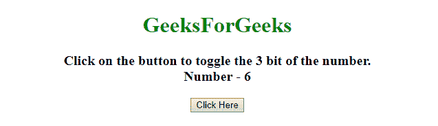
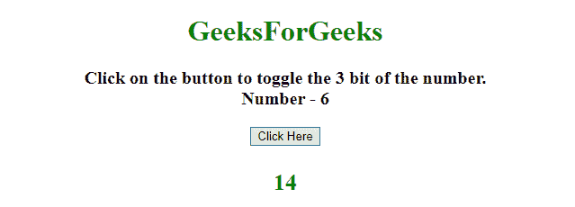

# 如何在 JavaScript 中设置、清除和切换数字的单个位？

> 原文：[https://www.geeksforgeeks.org/how-to-set-clear-and-toggle-a-single-bit-of-a-number-in-javascript/](https://www.geeksforgeeks.org/how-to-set-clear-and-toggle-a-single-bit-of-a-number-in-javascript/)

给定一个 JavaScript 数字，任务是设置、清除和切换任意数字的单个位。这里讨论了几个借助 JavaScript 的方法。

## 1. 设置位

*   获取要设置的位的位置（从右开始，第一位在 0 位置），例如 `setBit = 3`。
*   通过 `mask = 1 << setBit` 获取掩码，该掩码有助于设置、清除以及切换位。
*   使用 `|`（或运算符）设置特定位。

**示例：** 该示例使用了上面讨论的方法。

```html
<!DOCTYPE HTML>
<html>

<head>
    <title>
        Set, clear and toggle a single bit of a number.
    </title>
</head>

<body style="text-align:center;">
    <h1 style="color: green">
        GeeksForGeeks
    </h1>
    <p id="GFG_UP" style="font-size: 20px; font-weight: bold;">
    </p>
    <button onclick="gfg_Run()">
        Click Here
    </button>
    <p id="GFG_DOWN" style="color:green;">
    </p>
    <script>
        var el_up = document.getElementById("GFG_UP");
        var el_down = document.getElementById("GFG_DOWN");
        var n = 6;
        var setBit = 3;
        el_up.innerHTML = "Click on the button to set the "
            + setBit +
            " bit of the number.<br>Number - " + n

        function gfg_Run() {
            var mask = 1 << setBit;
            n = n | mask;
            el_down.innerHTML = n;
        }
    </script>
</body>

</html>
```

**输出：**

*   **点击按钮前：**
    
*   **点击按钮后：**
    

## 2. 清除位

*   获取要清除的位的位置（从右开始，第一位在 0 位置），例如 `setBit = 3`。
*   通过 `mask = 1 << setBit` 获取掩码，这个掩码有助于清除位。
*   使用 `&`（与运算符）和掩码的否定（`~mask`）清除特定位。

**示例：** 该示例使用了上面讨论的方法。

```html
<!DOCTYPE HTML>
<html>

<head>
    <title>
        Set, clear and toggle a single bit of a number.
    </title>
</head>

<body style="text-align:center;">
    <h1 style="color: green">
        GeeksForGeeks
    </h1>
    <p id="GFG_UP">
    </p>
    <button onclick="gfg_Run()">
        Click Here
    </button>
    <p id="GFG_DOWN" style="color:green;">
    </p>
    <script>
        var el_up = document.getElementById("GFG_UP");
        var el_down = document.getElementById("GFG_DOWN");
        var n = 6;
        var setBit = 2;
        el_up.innerHTML =
            "Click on the button to clear the "
            + setBit +
            " bit of the number.<br>Number - " + n

        function gfg_Run() {
            var mask = 1 << setBit;
            n &= ~mask;
            el_down.innerHTML = n;
        }
    </script>
</body>

</html>
```

**输出：**

*   **点击按钮前：**
    
*   **点击按钮后：**
    

## 3. 切换位

*   获取要切换的位的位置（从右开始，第一位在 0 位置），例如 `setBit = 3`。
*   通过 `mask = 1 << setBit` 获取掩码，这个掩码有助于切换位。
*   使用 `^`（异或运算符）切换特定位。

**示例：** 该示例使用了上面讨论的方法。

```html
<!DOCTYPE HTML>
<html>

<head>
    <title>
        Set, clear and toggle a single bit of a number.
    </title>
</head>

<body style="text-align:center;">
    <h1 style="color: green">
        GeeksForGeeks
    </h1>
    <p id="GFG_UP">
    </p>
    <button onclick="gfg_Run()">
        Click Here
    </button>
    <p id="GFG_DOWN" style="color:green;">
    </p>
    <script>
        var el_up = document.getElementById("GFG_UP");
        var el_down = document.getElementById("GFG_DOWN");
        var n = 6;
        var setBit = 3;
        el_up.innerHTML =
            "Click on the button to toggle the "
            + setBit +
            " bit of the number.<br>Number - " + n

        function gfg_Run() {
            var mask = 1 << setBit;
            n ^= mask;
            el_down.innerHTML = n;
        }
    </script>
</body>

</html>
```

**输出：**

*   **点击按钮前：**
    
*   **点击按钮后：**
    