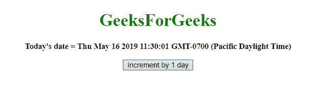
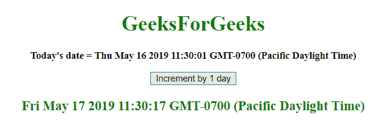
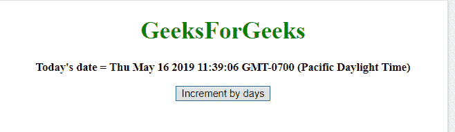
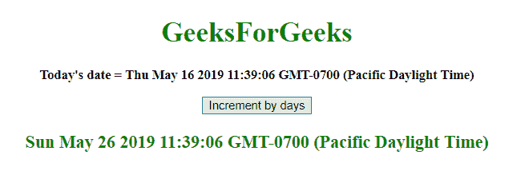

# 在 JavaScript 中增加给定的日期

> 原文：[https://www.geeksforgeeks.org/increment-a-given-date-in-javascript/](https://www.geeksforgeeks.org/increment-a-given-date-in-javascript/)

给定一个日期，任务是增加它。为了在 JavaScript 中增加日期，我们将讨论一些技巧。首先要知道的几个方法：

## JavaScript `getDate()` 方法
此方法返回定义日期的月份中的某一天（从 1 到 31）。
**语法：**
```javascript
Date.getDate()
```
**返回值：**
返回一个数字，从 1 到 31，表示一个月中的某一天。

## JavaScript `setDate()` 方法
此方法将月份中的日期设置为日期对象。
**语法：**
```javascript
Date.setDate(day)
```
**参数：**
*   **day**：此参数为必填项。它指定定义一个月中某一天的整数。预期值为 1-31，但小于 1 且大于 31 的值适用于上个月和下个月。

**返回值：**
它返回，表示日期对象和 1970 年 1 月 1 日午夜之间的毫秒数。

## JavaScript `getTime()` 方法
此方法返回 1970 年 1 月 1 日午夜与指定日期之间的毫秒数。
**语法：**
```javascript
Date.getTime()
```
**返回值：**
返回一个数字，代表 1970 年 1 月 1 日午夜以来的毫秒数。

## JavaScript `setTime()` 方法
该方法通过将定义的毫秒数加/减到/从 1970 年 1 月 1 日午夜开始来设置日期和时间。
**语法：**
```javascript
Date.setTime(millisec)
```
**参数：**
*   **millisec**：这个参数是必需的。它指定要加/减的毫秒数，1970 年 1 月 1 日午夜。

**返回值：**
它返回，表示日期对象和 1970 年 1 月 1 日午夜之间的毫秒数。

### 示例 1
本示例通过使用 `setDate()` 和 `getDate()` 方法，将 1 天增加到 **5 月 16 日**。
```html
<!DOCTYPE html>
<html>
<head>
    <title>
        JavaScript | Incrementing a date.
    </title>
</head>
<body style="text-align:center;" id="body">
    <h1 style="color:green;">
        GeeksForGeeks
    </h1>
    <p id="GFG_UP"
       style="font-size: 15px;
              font-weight: bold;">
    </p>
    <button onclick="gfg_Run()">
        Increment by 1 day
    </button>
    <p id="GFG_DOWN"
       style="color:green;
              font-size: 20px;
              font-weight: bold;">
    </p>
    <script>
        var el_up = document.getElementById("GFG_UP");
        var el_down = document.getElementById("GFG_DOWN");
        var today = new Date();
        el_up.innerHTML = "Today's date = " + today;

        function gfg_Run() {
            var tomorrow = new Date();
            tomorrow.setDate(today.getDate() + 1);
            el_down.innerHTML = tomorrow;
        }
    </script>
</body>
</html>
```
**输出：**
*   **点击按钮前：**
    
*   **点击按钮后：**
    

### 示例 2
本示例使用 `setTime()` 和 `getTime()` 方法将 10 天增加到 **5 月 16 日**。
```html
<!DOCTYPE html>
<html>
<head>
    <title>
        JavaScript | Incrementing a date.
    </title>
</head>
<body style="text-align:center;"
      id="body">
    <h1 style="color:green;">
        GeeksForGeeks
    </h1>
    <p id="GFG_UP"
       style="font-size: 15px;
              font-weight: bold;">
    </p>
    <button onclick="gfg_Run()">
        Increment by days
    </button>
    <p id="GFG_DOWN"
       style="color:green;
              font-size: 20px;
              font-weight: bold;">
    </p>
    <script>
        var el_up = document.getElementById("GFG_UP");
        var el_down = document.getElementById("GFG_DOWN");
        var today = new Date();
        var days = 10;
        el_up.innerHTML = "Today's date = " + today;

        function gfg_Run() {
            var tomorrow = new Date();
            tomorrow.setTime(today.getTime() + days * 86400000);
            el_down.innerHTML = tomorrow;
        }
    </script>
</body>
</html>
```
**输出：**
*   **点击按钮前：**
    
*   **点击按钮后：**
    