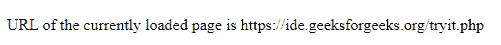

# JavaScript BOM 位置对象

> 原文：[https://www.geeksforgeeks.org/javascript-bom-location-object/](https://www.geeksforgeeks.org/javascript-bom-location-object/)

浏览器对象模型为 JavaScript 提供了与浏览器交互的属性和方法。BOM 允许通过 BOM 对象执行操作来操作浏览器窗口，而不会影响页面（即文档）的内容。BOM 对象是全局对象。

用于操纵浏览器窗口的 BOM 对象是：

*   `location`
*   `history`
*   `navigator`
*   `screen`
*   `document`

这些对象是 `window` 对象的子对象。`window` 对象表示浏览器窗口。因此，它们可以使用前缀：`window.object_name` 或者不使用前缀 `object_name`。

## `location.href`

返回浏览器窗口中当前加载的网页的 URL。

**语法：**

```html
console.log("URL of the web page " + location.href)
```

## `location.hostname`

返回当前主机的域名（不包括端口号）。

**语法：**

```html
console.log("Domain name of current host page is " + location.hostname)
```

## `location.protocol`

返回当前网页正在使用的网络协议（`http:`，`file:` 或 `https:`）。

**语法：**

```html
console.log("Protocol used by the current page is " + location.protocol)
```

## `location.assign`

当指定了完整的地址时，加载一个新的网页到窗口中。

**语法：**

```html
location.assign("http://www.google.com")
```

## `location.reload`

重新加载当前页面。其功能与浏览器窗口中的重新加载按钮相同。

**语法：**

```html
location.reload();
```

## 示例

本示例使用 `location` 对象的 `location.href` 属性。

```html
<!DOCTYPE html>
<html>
<body>
    <p id="a"></p>
    <script>
        document.getElementById("a").innerHTML
            = "URL of the currently loaded page is "
            + location.href;
    </script>
</body>
</html>
```

**输出：**

