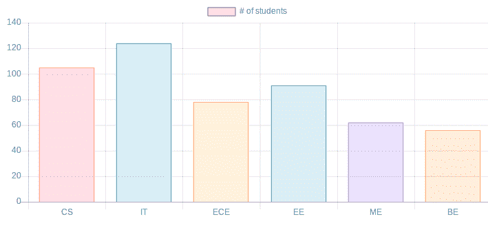

# JavaScript | Chart.js

> 原文：[https://www.geeksforgeeks.org/javascript-chart-js/](https://www.geeksforgeeks.org/javascript-chart-js/)

## 简介

Chart.js 是 [Github](https://github.com/chartjs/Chart.js) 上的一个开源 JavaScript 库，可以使用 HTML5 画布元素绘制不同类型的图表。由于它使用 `canvas`，您必须包含一个 `polyfill` 来支持旧的浏览器。

**那么，什么是 HTML5 画布元素？**

HTML5 `canvas` 元素为使用 JavaScript 绘制图形提供了一种简单而强大的方法。它可以用来绘制图表，制作照片合成或做简单（不那么简单）的动画。
它本质上是响应性的，这意味着它会在调整窗口大小时重新绘制图表，以获得完美的缩放粒度。

该库支持 **8 种不同类型的图形**：

1.  线条
2.  酒吧
3.  甜甜圈
4.  馅饼
5.  雷达
6.  极区
7.  泡泡
8.  分散

## 安装

最新版本的 Chart.js 可以从 `Github` 下载或者使用一个 Chart.js `CDN`。

## 创建图表的步骤

### 1. 包含 Chart.js

首先在 HTML 中包含 `chart.js`。

```html
<head>
<script src="https://cdnjs.cloudflare.com/ajax/libs/Chart.js/2.7.2/Chart.bundle.js"></script>
<link rel="stylesheet" type="text/css" href="style.css">
</head>
```

### 2. 创建 Canvas

要创建图表，我们需要表示 `Chart` 类。为此，我们需要传递 `jQuery` 实例或我们想要放置或绘制图表的画布的 2D 上下文。

例如：

```html
<canvas id="chart" width="900" height="900"></canvas>
```

### 3. 图表类型和数据

决定需要什么类型的图表并相应地准备数据。数据需要 `labels`、`datasets`、`data` 值、`backgroundColor`、`borderColor`、`borderWidth` 和各种其他选项。

例如：

```javascript
labels: ["CS", "IT", "ECE", "EE", "ME", "BE"],
datasets: [{
    label: '# of students',
    data: [105, 124, 78, 91, 62, 56],
    backgroundColor: [
        'rgba(255, 99, 132, 0.2)',
        'rgba(54, 162, 235, 0.2)',
        'rgba(255, 206, 86, 0.2)',
        'rgba(75, 192, 192, 0.2)',
        'rgba(153, 102, 255, 0.2)',
        'rgba(255, 159, 64, 0.2)'
    ],
    borderColor: [
        'rgba(255,99,132,1)',
        'rgba(54, 162, 235, 1)',
        'rgba(255, 206, 86, 1)',
        'rgba(75, 192, 192, 1)',
        'rgba(153, 102, 255, 1)',
        'rgba(255, 159, 64, 1)'
    ]
}]
```

最后，我们应该从线条、条形图、雷达图、饼图、甜甜圈图、极坐标图、气泡图和散点图来决定图表的类型。

### 4. 创建图表

在定义要绘制的图表类型后，将我们想要可视化的数据传递给该图表。下面是一个例子：

```javascript
var ctx = document.getElementById("chart");
var myChart = new Chart(ctx, {
    type: 'bar',
    data: {
        labels: ["CS", "IT", "ECE", "EE", "ME", "BE"],
        datasets: [{
            label: '# of students',
            data: [105, 124, 78, 91, 62, 56],
            backgroundColor: [
                'rgba(255, 99, 132, 0.2)',
                'rgba(54, 162, 235, 0.2)',
                'rgba(255, 206, 86, 0.2)',
                'rgba(75, 192, 192, 0.2)',
                'rgba(153, 102, 255, 0.2)',
                'rgba(255, 159, 64, 0.2)'
            ],
            borderColor: [
                'rgba(255,99,132,1)',
                'rgba(54, 162, 235, 1)',
                'rgba(255, 206, 86, 1)',
                'rgba(75, 192, 192, 1)',
                'rgba(153, 102, 255, 1)',
                'rgba(255, 159, 64, 1)'
            ],
            borderWidth: 1
        }]
    }
});
```

## 完整代码示例

```html
<!DOCTYPE html>
<html>
<head>
<script src="https://cdnjs.cloudflare.com/ajax/libs/Chart.js/2.7.2/Chart.bundle.js"></script>
</head>
<body>

<canvas id="myChart" width="900" height="400"></canvas>
<script type="text/javascript">
var ctx = document.getElementById("myChart");
var myChart = new Chart(ctx, {
    type: 'bar',
    data: {
        labels: ["CS", "IT", "ECE", "EE", "ME", "BE"],
        datasets: [{
            label: '# of students',
            data: [105, 124, 78, 91, 62, 56],
            backgroundColor: [
                'rgba(255, 99, 132, 0.2)',
                'rgba(54, 162, 235, 0.2)',
                'rgba(255, 206, 86, 0.2)',
                'rgba(75, 192, 192, 0.2)',
                'rgba(153, 102, 255, 0.2)',
                'rgba(255, 159, 64, 0.2)'
            ],
            borderColor: [
                'rgba(255,99,132,1)',
                'rgba(54, 162, 235, 1)',
                'rgba(255, 206, 86, 1)',
                'rgba(75, 192, 192, 1)',
                'rgba(153, 102, 255, 1)',
                'rgba(255, 159, 64, 1)'
            ],
            borderWidth: 1
        }]
    },
    options: {
        scales: {
            yAxes: [{
                ticks: {
                    beginAtZero: true
                }
            }]
        }
    }
});
</script>

</body>
</html>
```

## 输出

