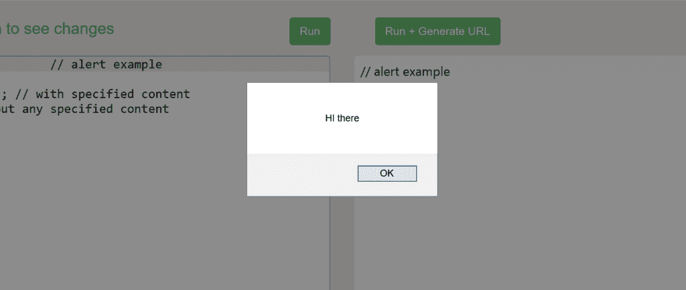
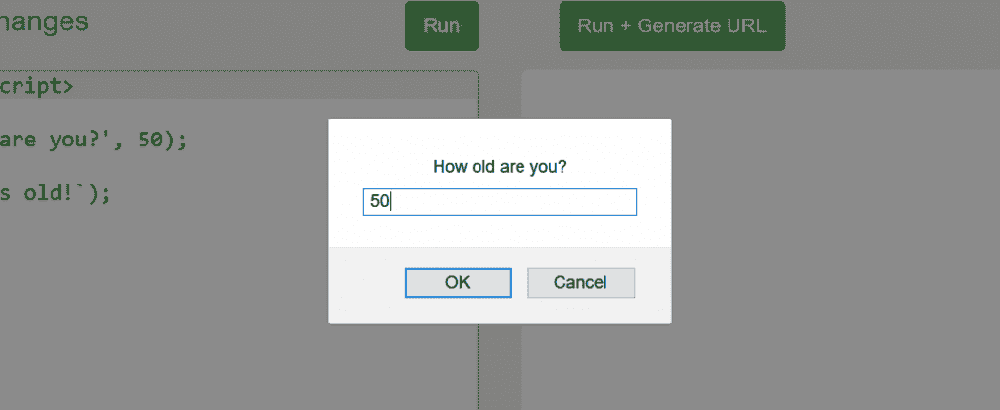
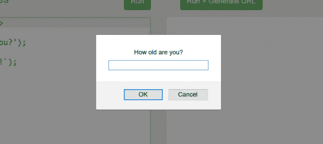
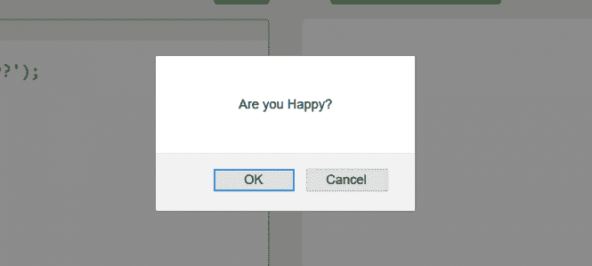

# JavaScript 课程：与用户的交互

> 原文：[https://www.geeksforgeeks.org/javascript-course-interaction-with-user/](https://www.geeksforgeeks.org/javascript-course-interaction-with-user/)

**上一篇文章:** [JavaScript 课程|练习小测验-1](https://www.geeksforgeeks.org/javascript-course-quiz-1/)

Javascript 让我们拥有了与用户交互并做出相应响应的特权。它包括几个有助于交互的用户界面功能。让我们一个接一个地看一看。

## alert

`alert()` 会创建一个提示框，其中可能包含也可能不包含指定的内容，但它总是带有一个“确定”按钮。它只是显示一条消息，并暂停脚本的执行，直到你按下“确定”按钮。弹出的迷你窗口被称为“模态窗口”。

```
alert('text');
```

**示例:**

```html
<script>
  alert('HI there'); // 带有指定内容
  alert(); // 没有指定内容
</script>
```

**输出:**


可以用来调试，也可以简单的给用户弹出一些东西。

## prompt

`prompt()` 是另一个用户界面函数，通常包含两个参数。

```
prompt('text', defaultValue);
```

`text` 基本上是您想要向用户显示的内容，`defaultValue` 参数是可选的，尽管它在文本字段中充当占位符。这是最常用的界面，因为有了它，你可以要求用户输入一些东西，然后使用这些输入来构建一些东西。

**示例：（带默认参数）**

```html
<script>
  // prompt example
  let age = prompt('How old are you?', 50);
  alert(`You are ${age} years old!`);
</script>
```

**输出:**


你可以输入任何东西，它会打印出来，不一定是数字。如果没有默认值，您必须在文本字段中输入一些内容，否则它将只打印一个空格。

**示例：**

```html
<script>
  // prompt example
  let age = prompt('How old are you?');
  alert(`You are ${age} years old!`);
</script>
```

**输出:**


## confirm

`confirm()` 函数基本上输出一个带有问题和“确定”、“取消”两个按钮的模态窗口。

```
confirm('question');
```

**示例:**

```html
<script>
  // confirm example
  let isHappy = confirm('Are you Happy?');
  alert(`You are ${isHappy}`);
</script>
```

**输出:**


分别根据点击“确定”按钮或“取消”按钮的选择打印 `true` 或 `false`。

**下一篇:** [JavaScript 教程| JavaScript 中的逻辑运算符](https://www.geeksforgeeks.org/javascript-course-logical-operators-in-javascript/)