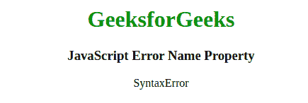
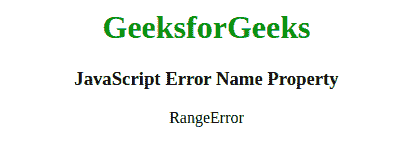
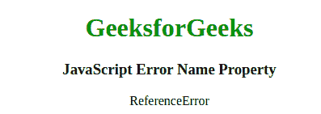
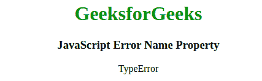

# JavaScript 错误名称属性

> 原文: [https://www.geeksforgeeks.org/javascript-error-name-property/](https://www.geeksforgeeks.org/javascript-error-name-property/)

以下是错误名称属性的示例。

## 例

```html
<script>
    try {
        eval("alert('GeeksforGeeks)");
    } catch (err) {
        document.write(err.name);
    }
</script>
```

**输出:**

```
SyntaxError
```

在 JavaScript 中，错误名称属性用于设置或返回错误的名称。

## 语法

```
errorObj.name
```

## 属性值

该属性包含六个不同的值，如下所述:

*   **SyntaxError:** 表示语法错误。
*   **RangeError:** 表示范围内的误差。
*   **ReferenceError:** 表示非法引用。
*   **TypeError:** 表示类型错误。
*   **EvalError:** 表示 `eval()` 函数出现错误。
*   **URIError:** 它表示 `encodeURI()` 中的一个错误。

## 返回值

返回一个字符串，代表错误的名称。

上述属性的更多示例代码如下:

### 程序 1

本例显示语法错误。

```html
<!DOCTYPE html>
<html>
    <body style="text-align: center;">
        <h1 style="color: green;">
            GeeksforGeeks
        </h1>
        <h3>
            JavaScript Error Name Property
        </h3>
        <p id="gfg"></p>
        <script>
            try {
                eval("alert('Geeks for Geeks)");
            } catch (err) {
                document.getElementById("gfg").innerHTML = err.name;
            }
        </script>
    </body>
</html>
```

**输出:**


### 程序 2

本例显示范围误差。

```html
<!DOCTYPE html>
<html>
    <body style="text-align: center;">
        <h1 style="color: green;">
            GeeksforGeeks
        </h1>
        <h3>
            JavaScript Error Name Property
        </h3>
        <p id="gfg"></p>
        <script>
            var num = 0;
            try {
                num.toPrecision(1000);
            } catch (err) {
                document.getElementById("gfg").innerHTML = err.name;
            }
        </script>
    </body>
</html>
```

**输出:**


### 程序 3

本例显示参考误差。

```html
<!DOCTYPE html>
<html>
    <body style="text-align: center;">
        <h1 style="color: green;">
            GeeksforGeeks
        </h1>
        <h3>
            JavaScript Error Name Property
        </h3>
        <p id="gfg"></p>
        <script>
            var y;
            try {
                y = x + y;
            } catch (err) {
                document.getElementById("gfg").innerHTML = err.name;
            }
        </script>
    </body>
</html>
```

**输出:**


### 程序 4

本例显示类型错误。

```html
<!DOCTYPE html>
<html>
    <body style="text-align: center;">
        <h1 style="color: green;">
            GeeksforGeeks
        </h1>
        <h3>
            JavaScript Error Name Property
        </h3>
        <p id="gfg"></p>
        <script>
            var x = 1;
            try {
                x.toLowerCase();
            } catch (err) {
                document.getElementById("gfg").innerHTML = err.name;
            }
        </script>
    </body>
</html>
```

**输出:**


## 浏览器支持

JavaScript 错误名称属性支持的浏览器如下:

*   Google Chrome
*   Firefox
*   Microsoft Edge
*   Opera
*   Safari