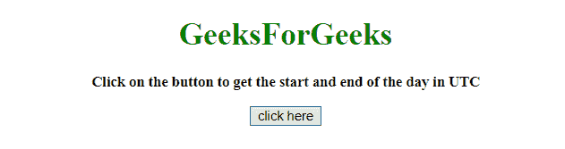
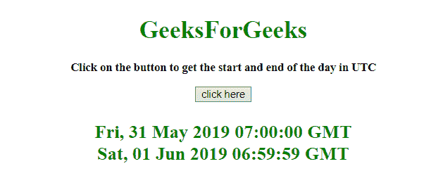

# JavaScript 获取一天的开始和结束时间（UTC）

> 原文：[https://www.geeksforgeeks.org/javascript-get-the-start-and-end-of-the-day-in-utc/](https://www.geeksforgeeks.org/javascript-get-the-start-and-end-of-the-day-in-utc/)

给定一个日期，任务是使用 JavaScript 确定一天的开始和结束。我们将讨论一些技巧。
首先要知道的几个方法。

## `setHours()` 方法

[`setHours()`](https://www.geeksforgeeks.org/javascript-date-sethours-function/) 方法用于设置日期对象的小时数。
此方法也可用于设置分钟、秒和毫秒。

**语法：**

```javascript
Date.setHours(hour, min, sec, millisec)
```

### 参数

*   `hour`：此参数为必填项。它指定表示小时的整数。接受的值为 0-23，但也允许其他值。
    *   -1 表示前一天的最后一个小时，24 表示第二天的第一个小时。
*   `min`：此参数为可选。它指定表示分钟的整数。接受的值为 0-59，但也允许其他值。
    *   60 表示下一小时的第一分钟，-1 表示前一小时的最后一分钟。
*   `sec`：此参数可选。它指定表示秒的整数。接受的值为 0-59，但也允许其他值。
    *   60 表示下一分钟的第一秒，而 -1 表示前一分钟的最后一秒。
*   `millisec`：此参数为可选。它指定表示毫秒的整数。接受的值为 0-999，但也允许其他值。
    *   -1 表示前一秒的最后一毫秒，1000 表示下一秒的第一毫秒。

### 返回值

返回一个数字，代表日期对象到 1970 年 1 月 1 日午夜之间的毫秒数。

## `toUTCString()` 方法

[`toUTCString()`](https://www.geeksforgeeks.org/javascript-date-toutcstring-function/) 方法将 Date 对象转换为一个字符串，依据通用时间。

**语法：**

```javascript
Date.toUTCString()
```

### 返回值

返回一个字符串，以字符串形式表示 UTC 日期和时间。

## 示例 1

本示例使用 `setHours()` 方法获取一天中的第一毫秒和最后一毫秒，并使用 `toUTCString()` 方法将其转换为 UTC 格式。

```html
<!DOCTYPE HTML>
<html>

<head>
    <title>
        JavaScript | Get start and end of day in UTC.
    </title>
    <script src="https://ajax.googleapis.com/ajax/libs/jquery/3.4.0/jquery.min.js">
    </script>
</head>

<body style="text-align:center;" id="body">
    <h1 style="color:green;">
        GeeksForGeeks
    </h1>
    <p id="GFG_UP" style="font-size: 15px; font-weight: bold;">
    </p>
    <button onclick="GFG_Fun(); ">
        click here
    </button>
    <p id="GFG_DOWN" style="color: green; font-size: 24px; font-weight: bold;">
    </p>
    <script>
        var up = document.getElementById('GFG_UP');
        up.innerHTML = 'Click on the button to get the start and end of the day in UTC';

        var down = document.getElementById('GFG_DOWN');
        var startOfDay = new Date();
        startOfDay.setHours(0, 0, 0, 0);
        var endofDay = new Date();
        endofDay.setHours(23, 59, 59, 999);

        function GFG_Fun() {
            down.innerHTML = startOfDay.toUTCString() +
                '<br>' + endofDay.toUTCString();
        }
    </script>
</body>

</html>
```

### 输出

*   **点击按钮前:**
    
*   **点击按钮后:**
    

## 示例 2

本示例获取一天中的第一毫秒和最后一毫秒，但方法与之前不同，使用 `setHours()` 方法并使用 `toUTCString()` 方法将其转换为 UTC 格式。

```html
<!DOCTYPE HTML>
<html>

<head>
    <title>
        JavaScript | Get start and end of day in UTC.
    </title>
    <script src="https://ajax.googleapis.com/ajax/libs/jquery/3.4.0/jquery.min.js">
    </script>
</head>

<body style="text-align:center;" id="body">
    <h1 style="color:green;">
        GeeksForGeeks
    </h1>
    <p id="GFG_UP" style="font-size: 15px; font-weight: bold;">
    </p>
    <button onclick="GFG_Fun(); ">
        click here
    </button>
    <p id="GFG_DOWN" style="color: green; font-size: 24px; font-weight: bold;">
    </p>
    <script>
        var up = document.getElementById('GFG_UP');
        up.innerHTML = 'Click on the button to get the start and end of the day in UTC';

        var down = document.getElementById('GFG_DOWN');
        var startOfDay = new Date();
        startOfDay.setHours(0, 0, 0, 0);
        var endofDay = new Date();
        endofDay.setHours(24, 0, 0, -1);

        function GFG_Fun() {
            down.innerHTML = startOfDay.toUTCString() +
                '<br>' + endofDay.toUTCString();
        }
    </script>
</body>

</html>
```

### 输出

*   **点击按钮前:**
    
*   **点击按钮后:**
    