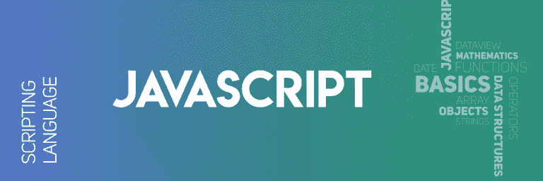

# JavaScript 面试问答

> 原文：[https://www.geeksforgeeks.org/javascript-interview-questions-and-answers/](https://www.geeksforgeeks.org/javascript-interview-questions-and-answers/)



## 1. Java 和 JavaScript 有什么区别？
JavaScript 是一种客户端脚本语言，而 Java 是面向对象编程语言，两者完全不同。
*   **JavaScript：** 它是一种轻量级编程语言（“脚本语言”），用于开发交互式网页。它可以在 HTML 元素中插入动态文本。JavaScript 也被称为浏览器的语言。
*   **Java：** Java 是最流行、使用最广泛的编程语言之一。它是一种面向对象的编程语言，并且有一个虚拟机平台，允许您创建几乎在每个平台上运行的编译程序。Java 承诺，“只写一次，随处运行”。

## 2. 什么是 JavaScript 数据类型？
JavaScript 中有三种主要的数据类型。
*   原始类型
    *   数字
    *   字符串
    *   布尔值
*   空类型
    *   null
    *   undefined
*   复合类型
    *   对象
    *   函数
    *   数组

## 3. JavaScript 中用什么符号表示注释？
注释用于防止语句执行。编译器执行代码时会忽略注释。JavaScript 中有两种表示注释的符号：
*   **双斜杠：** 被称为单行注释。
```
// Single line comment
```
*   **带星号的斜线：** 被称为多行注释。
```
/* 
Multi-line comments
...
*/
```

## 4. `3+2+”7″` 的结果会是什么？
这里 `3` 和 `2` 表现得像整数，而 `”7″` 表现得像字符串。所以 `3` 加 `2` 等于 `5`。然后输出将是 `5+”7″ = 57`。

## 5. `isNaN` 函数有什么用？
JavaScript 中的 `Number.isNaN` 函数用于确定传递的值是否是 `NaN`（非数字）并且类型为 `”Number”`。在 JavaScript 中，`NaN` 值被认为是数字的一种类型。如果参数不是数字，它返回 `true`，否则返回 `false`。

## 6. JavaScript 和 ASP 脚本哪个更快？
JavaScript 比 ASP 脚本更快，因为 JavaScript 是一种客户端脚本语言，不依赖于服务器来执行，而 ASP 脚本是一种服务器端脚本语言，总是依赖于服务器。

## 7. 什么是负无穷大？
JavaScript 中的负无穷大是一个常量值，用于表示可用的最低值。这意味着没有其他数字比这个值更小。它可以通过自定义函数或算术运算生成。JavaScript 将 `NEGATIVE_INFINITY` 值显示为 `-Infinity`。

## 8. 是否可以将 JavaScript 代码拆分成多行？
是的，在字符串语句中可以将 JavaScript 代码拆分成多行。可以使用反斜杠 `‘\’` 来实现。例如：
```
document.write("A Online Computer Science Portal\ for Geeks")
```
JavaScript 避免代码换行，这是不可取的。
```
var gfg= 10, GFG = 5,
Geeks =
gfg + GFG;
```

## 9. 哪家公司开发了 JavaScript？
Netscape 开发了 JavaScript，由 Brenden Eich 在 1995 年创建。

## 10. 什么是未声明和未定义的变量？
*   **未定义：** 当一个变量已经被声明，但没有被赋值时，就会出现这种情况。`undefined` 不是关键字。
*   **未声明：** 当我们尝试使用 `var` 或 `const` 关键字访问任何未初始化或未提前声明的变量时，就会出现这种情况。如果我们使用 `”typeof”` 运算符来获取未声明变量的值，我们将面临返回值为 `”undefined”` 的运行时错误。未声明变量的作用域总是全局的。

## 11. 编写用于动态添加新元素的 JavaScript 代码
```
<!DOCTYPE html>
<html>
<head>
    <title>
        JavaScript code for adding new
        elements dynamically
    </title>
</head>
<body>
    <button onclick="create()">
        Click Here!
    </button>
    <script>
        function create() {
            var geeks = document.createElement('geeks');
            geeks.textContent = "Geeksforgeeks";
            geeks.setAttribute('class', 'note');
            document.body.appendChild(geeks);
        }
    </script>
</body>
</html>
```

## 12. 什么是全局变量？如何声明这些变量，以及与之相关的问题是什么？
全局变量是在函数外部定义的变量。这些变量具有全局作用域，因此任何函数都可以使用它们，而无需将它们作为参数传递给函数。
**示例：**
```
<script> 
    var petName = "Rocky"; //Global Variable 
    myFunction();
    function myFunction() { 
        document.getElementById("geeks").innerHTML
            = typeof petName + "- " + 
            "My pet name is " + petName; 
    }
    document.getElementById("Geeks").innerHTML
        = typeof petName + "- " + 
        "My pet name is " + petName; 
</script> 
```
依赖全局变量的代码很难调试和测试。

## 13. JavaScript 中的 NULL 是什么意思？
`NULL` 值表示没有值或没有对象。它可以被称为空值/对象。

## 14. 如何删除属性的特定值？
`delete` 关键字用于一次性删除整个属性和所有值，例如：
```
var gfg={Course: "DSA", Duration:30};
delete gfg.Course;
```

## 15. 什么是提示框？
它用于显示一个带有可选消息的对话框，提示用户输入一些文本。如果用户想在进入页面前输入一个值，通常会使用它。它返回一个包含用户输入文本的字符串，或 `null`。

## 16. JavaScript 中的 `this` 关键字是什么？
JavaScript 中的函数是重要的对象。像对象一样，它们可以被赋值给变量、传递给其他函数以及从函数返回。而且很像对象，它们有自己的属性。
`this` 存储 JavaScript 程序的当前执行上下文。因此，当它在函数内部使用时，`this` 的值将根据函数的定义方式、调用方式以及默认执行上下文而变化。

## 17. 解释 JavaScript 中定时器的工作原理？并说明使用定时器的缺点（如果有）？
定时器用于在特定时间执行一些特定代码，或重复执行少量代码，为此你需要使用 `setTimeout`、`setInterval` 和 `clearInterval` 函数。如果 JavaScript 代码设置了 2 分钟的定时器，当时间到时，页面会显示一个警告消息 `”times up”`。`setTimeout()` 方法在指定的毫秒数后调用一个函数或计算一个表达式。

## 18. `ViewState` 和 `SessionState` 有什么区别？
*   **ViewState：** 特定于会话中的单个页面。
*   **SessionState：** 是用户特定的，可以访问网页中的所有数据。

## 19. 如何使用 JavaScript 提交表单？
你可以使用 `document.form[0].submit()` 方法在 JavaScript 中提交表面。

## 20. JavaScript 支持自动类型转换吗？
是的，JavaScript 支持自动类型转换。

**相关文章：** [常见 JavaScript 面试问题 | 第一集](https://www.geeksforgeeks.org/commonly-asked-javascript-interview-questions-set-1/)