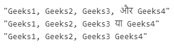

# JavaScript | Intl.ListFormat.prototype.format()方法

> 原文: [https://www.geeksforgeeks.org/javascript-intl-listformat-prototype-format-method/](https://www.geeksforgeeks.org/javascript-intl-listformat-prototype-format-method/)

`Intl.ListFormat.prototype.format()`方法是 JavaScript 中的一个内置方法，它返回一个带有列表的特定语言表示的字符串。

## 语法:
```
listFormat.format([list]);
```

## 参数:
该方法接受上述单个参数，描述如下:
* `list`: 此参数保存一个可迭代的对象，如数组。

## 返回值:
这个方法返回一个语言特定的格式化字符串，代表列表的元素。

下面的例子说明了 JavaScript 中的 `Intl.ListFormat.prototype.format()` 方法:

## 示例 1:
```javascript
<script>
const gfg = ['Geeks1', 'Geeks2', 'Geeks3', 'Geeks4'];

const result1 = new Intl.ListFormat('en',
    { style: 'long', type: 'conjunction' });
console.log(result1.format(gfg));

const result2 = new Intl.ListFormat('db',
    { style: 'short', type: 'disjunction' });
console.log(result2.format(gfg));

const result3 = new Intl.ListFormat('en',
    { style: 'narrow', type: 'unit' });
console.log(result3.format(gfg));
</script>
```

## 输出:
```
"Geeks1, Geeks2, Geeks3, and Geeks4"
"Geeks1, Geeks2, Geeks3, or Geeks4"
"Geeks1 Geeks2 Geeks3 Geeks4"
```

## 示例 2:
```javascript
<script>
const gfg = ['Geeks1', 'Geeks2', 'Geeks3', 'Geeks4'];

const result1 = new Intl.ListFormat('hi',
    { style: 'long', type: 'conjunction' });
console.log(result1.format(gfg));

const result2 = new Intl.ListFormat('hi',
    { style: 'short', type: 'disjunction' });
console.log(result2.format(gfg));

const result3 = new Intl.ListFormat('hi',
    { style: 'narrow', type: 'unit' });
console.log(result3.format(gfg));
</script>
```

## 输出:


## 支持的浏览器:
`Intl.ListFormat.prototype.format()` 方法支持的浏览器如下:
* Google Chrome 72 及以上
* Edge 79 及以上
* Firefox 78 及以上版本
* Opera 60 及以上
* Safari 14.1 及以上版本