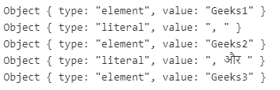

# JavaScript Intl.ListFormat.prototype.formatToParts()方法

> 原文：[https://www.geeksforgeeks.org/javascript-intl-listformat-prototype-formattoparts-method/](https://www.geeksforgeeks.org/javascript-intl-listformat-prototype-formattoparts-method/)

`Intl.ListFormat.prototype.formatToParts()`方法是 JavaScript 中的一个内置方法，它返回一个表示不同组件的对象数组，这些组件可用于以区域感知的方式格式化值列表。

## 语法

```
Intl.ListFormat.prototype.formatToParts(list)
```

### 参数

该方法接受上述单个参数，描述如下：

*   `list`：该参数保存一个要根据区域设置格式化的值数组。

### 返回值

该方法返回一个包含列表中格式化部分的组件数组。

下面的例子说明了 JavaScript 中的 `Intl.ListFormat.prototype.formatToParts()` 方法：

## 示例 1

```javascript
<script>
const gfg = ['Geeks1', 'Geeks2', 'Geeks3'];
const result = new Intl.ListFormat('en-GB',
    { style: 'long', type: 'conjunction' });

let val = result.formatToParts(gfg);

console.log(val[0]);
console.log(val[1]);
console.log(val[2]);
console.log(val[3]);
console.log(val[4]);
</script>
```

**输出：**

```
Object { type: "element", value: "Geeks1" }
Object { type: "literal", value: ", " }
Object { type: "element", value: "Geeks2" }
Object { type: "literal", value: " and " }
Object { type: "element", value: "Geeks3" }
```

## 示例 2

```javascript
<script>
const gfg = ['Geeks1', 'Geeks2', 'Geeks3'];
const result = new Intl.ListFormat('hi',
    { style: 'long', type: 'conjunction' });

let val = result.formatToParts(gfg);

console.log(val[0]);
console.log(val[1]);
console.log(val[2]);
console.log(val[3]);
console.log(val[4]);
</script>
```

**输出：**



**支持的浏览器：**`Intl.ListFormat` 支持的浏览器如下：

*   谷歌 Chrome 72 及以上
*   边缘 79 及以上
*   Firefox 78 及以上版本
*   歌剧 60 及以上
*   Safari 14.1 及以上