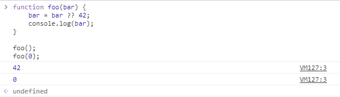
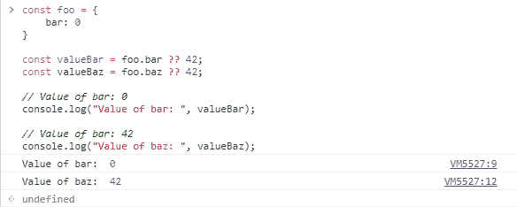

# JavaScript 无效合并操作符

> 原文: [https://www.geeksforgeeks.org/javascript-nullish-coalescing-operator/](https://www.geeksforgeeks.org/javascript-nullish-coalescing-operator/)

## 简介

无效合并操作符是 ECMA 提案中引入的一个新特性，现已被正式的 JavaScript 规范采用。如果左侧值为`null`或`undefined`，则该运算符返回右侧值。如果不为`null`或`undefined`，那么它将返回左边的值。

之前，设置`undefined`和`null`变量的默认值需要使用`if`语句或逻辑 or 运算符`||`，如下所示。

## 示例

下面是无效合并运算符的示例。

**例:**

```html
<script>
function foo(bar) {
    bar = bar ?? 55;
    document.write(bar);
    document.write("</br>");
}
foo();  // 55
foo(22); // 22
</script>
```

**输出:**

```
55
22
```

## 语法

无效合并运算符由两个相邻的问号`??`定义，其用途如下：

```
variable ?? default_value
```

**示例:** 如果传递的变量为`null`或`undefined`，并且只有当它是这两个值时，才会返回默认值。在所有其他情况下，包括`0`、空字符串或`false`，将返回变量值，而不是默认值。

## 更多示例

当传递的参数小于函数原型中定义的参数个数时，赋予其`undefined`的值。要为函数调用期间未传递的参数设置默认值，或者为 JSON 对象中不存在的字段设置默认值，上述方法很受欢迎。

**程序 1:**

```html
<script>
function foo(bar) {
    bar = bar || 42;
    console.log(bar);
}
// Output: 42
foo();
</script>
```

**输出:**

```
42
```

JavaScript 中有一些值，比如`0`和空字符串，本质上是逻辑假的。这些值可能会改变用 JavaScript 编写的程序的预期行为。

所有重复出现的问题导致了无效合并操作符的开发。

**程序 2:**

```html
<script>
function foo(bar) {
    bar = bar ?? 42;
    console.log(bar);
}
foo();  // 42
foo(0); // 0
</script>
```

**输出:** 

**程序 3:** 更常见的用例是如下设置 JSON 对象的默认值。

```html
<script>
const foo = {
    bar: 0
}
const valueBar = foo.bar ?? 42;
const valueBaz = foo.baz ?? 42;
// Value of bar: 0
console.log("Value of bar: ", valueBar);
// Value of baz: 42
console.log("Value of baz: ", valueBaz);
</script>
```

**输出:**


## 浏览器支持

JavaScript nullish 合并操作符支持的浏览器如下:

*   谷歌 Chrome 80
*   Firefox 72