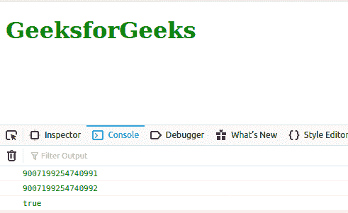
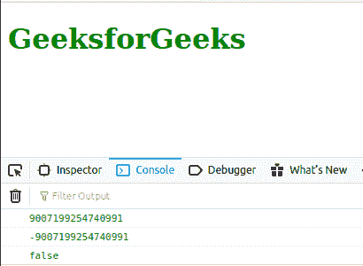

# JavaScript Number.MAX_SAFE_INTEGER 常量

> 原文：`https://www.geeksforgeeks.org/javascript-number-max_safe_integer-constant/`

下面是数字的例子。最小安全整数常数。

## 示例

```javascript
<script type="text/javascript">
    document.write(Number.MIN_SAFE_INTEGER); 
</script> 
```

## 输出

```

```

`Number.MAX_SAFE_INTEGER` 是代表最大安全整数的常数。该常数的值为 (2<sup>53</sup>–1)。这里 *safe* 指的是表示整数和比较整数的能力。

## 示例

```javascript
Number.MAX_SAFE_INTEGER + 1 === Number.MAX_SAFE_INTEGER + 2
```

上面的表达式将评估为 *真*，这实际上在数学上是不正确的。

## 语法

```javascript
Number.MAX_SAFE_INTEGER
```

## 返回值

一个常数。

## 示例 1

下面的例子说明了 `Number.MAX_SAFE_INTEGER` 的用法。

```html
<!DOCTYPE html>
<html lang="en">

<body>
    <h1 style="color: green;">GeeksforGeeks</h1>
    <script type="text/javascript">
        const a = Number.MAX_SAFE_INTEGER + 1;
        const b = Number.MAX_SAFE_INTEGER + 2;

        console.log(Number.MAX_SAFE_INTEGER);
        console.log(a);
        console.log(a === b);
    </script>
</body>

</html>
```

## 输出



## 示例 2

下面的例子说明了常量 `Number.MAX_SAFE_INTEGER` 的用法。使用 `Math.pow()` 函数。

```html
<!DOCTYPE html>
<html lang="en">

<body>
    <h1 style="color: green;">GeeksforGeeks</h1>
    <script type="text/javascript">
        const a = Number.MAX_SAFE_INTEGER;
        const b = -(Math.pow(2, 53) - 1);

        console.log(a);
        console.log(b);
        console.log(a === b);
    </script>
</body>

</html>
```

## 输出



## 支持的浏览器

*   Chrome
*   Internet Explorer (不支持)
*   Firefox
*   Edge
*   Safari
*   Opera