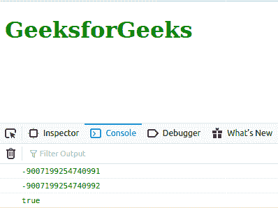
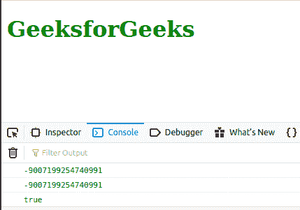

# JavaScript Number.MIN_SAFE_INTEGER 常数

> 原文: [https://www.geeksforgeeks.org/javascript-number-min_safe_integer-constant/](https://www.geeksforgeeks.org/javascript-number-min_safe_integer-constant/)

下面是 `Number.MIN_SAFE_INTEGER` 常数的例子。

*   **例:**

```html
<script type="text/javascript">
    document.write(Number.MIN_SAFE_INTEGER); 
</script> 
```

*   **输出:**

```
-9007199254740991
```

`Number.MIN_SAFE_INTEGER` 是一个常数，代表 JavaScript 中最小的安全整数。该常数的值为 `-(2^53 - 1)`。

使用 `Number.MIN_SAFE_INTEGER` 作为 `Number` 对象的属性，因为它是 `Number` 的静态属性。

## 语法

```
Number.MIN_SAFE_INTEGER
```

**返回值:** 常数。

## 例 1

下面的例子说明了简单 `Number.MIN_SAFE_INTEGER` 常数的用法。

```html
<!DOCTYPE html>
<html lang="en">
<body>
    <h1 style="color: green;">GeeksforGeeks</h1>
    <script type="text/javascript">
        const a = Number.MIN_SAFE_INTEGER - 1;
        const b = Number.MIN_SAFE_INTEGER - 2;

        console.log(Number.MIN_SAFE_INTEGER);
        console.log(a);
        console.log(a === b);
    </script>
</body>
</html>
```

**输出:**



## 例 2

下面的例子说明了使用 `Math.pow()` 函数的 `Number.MIN_SAFE_INTEGER` 常数的用法。

```html
<!DOCTYPE html>
<html lang="en">
<body>
    <h1 style="color: green;">GeeksforGeeks</h1>
    <script type="text/javascript">
        const c = Number.MIN_SAFE_INTEGER;
        const d = -(Math.pow(2, 53) - 1);

        console.log(c);
        console.log(d);
        console.log(c === d);
    </script>
</body>
</html>
```

**输出:**



**注意:** 不支持 Internet Explorer。

## 支持的浏览器

1.  Chrome
2.  Edge
3.  Firefox
4.  Opera
5.  Safari