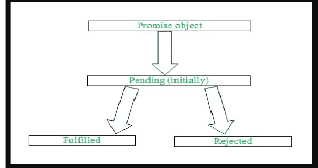

# JavaScript 承诺链

> 原文：[https://www.geeksforgeeks.org/javascript-promise-chaining/](https://www.geeksforgeeks.org/javascript-promise-chaining/)

在本文中，我们将讨论如何在 JavaScript 中执行承诺链。一个 [`Promise`](https://www.geeksforgeeks.org/javascript-promises/) 基本上是一个对象，表示异步操作的完成（或失败）及其结果。

## 承诺的状态

承诺有三种状态，基于这些状态，承诺执行结果。

*   **待定：** 该状态表示初始状态或完成状态或拒绝状态。
*   **已完成：** 该状态表示异步操作成功完成。
*   **拒绝：** 该状态表示异步操作被拒绝。



使用 [`Promise.prototype.then()`](https://www.geeksforgeeks.org/why-we-use-then-method-in-javascript/) 方法写成后宣告承诺。如果我们需要处理发生的任何错误，那么我们使用 [`Promise.prototype.catch()`](https://www.geeksforgeeks.org/jquery-deferred-catch-method/) 方法写在答应之后。我们也使用 [`Promise.prototype.finally()`](https://www.geeksforgeeks.org/javascript-promise-finally-method/) 方法如果我们只想打印我们的结果，而不考虑在承诺执行期间发生的任何错误。

## 声明承诺

我们可以使用以下语法声明承诺。

```javascript
let promise = new Promise((resolve, reject) => {
    resolve('Hello JavaScript !');
});
```

正如您在上面的语法中看到的，有一个回调函数在 `Promise` 对象中传递，该对象使用两个方法作为参数。首先，一个是 [`resolve()`](https://www.geeksforgeeks.org/javascript-promise-resolve-method/) ，它负责成功完成任何文本或任何可执行的东西在其中传递。

第二个是 [`reject()`](https://www.geeksforgeeks.org/javascript-promise-reject-method/)，它负责一个操作的不成功完成，我们可以传递其中的文本，它会随着我们的错误一起显示出来。

## 执行承诺

我们可以使用以下语法来执行承诺。

### 方法 1

```javascript
let promise = new Promise((resolve, reject) => {
  resolve("Hello JavaScript !");
});

promise.then((result) => console.log(result));
```

**输出：** 如上所示，`result` 变量用于控制来自 `resolve()` 方法的结果。

```
Hello JavaScript !
```

### 方法 2

```javascript
let promise = new Promise((resolve, reject) => {
  resolve("Hello JavaScript !");
});

promise.then((result) => {
  console.log(result);
});
```

**输出：** 在这个方法中，内部传递了一个回调函数给 `then()` 方法。在回调函数中，`result` 变量被声明，负责打印出来自 `resolve()` 方法的结果。

```
Hello JavaScript !
```

## 承诺链

承诺链是一个简单的概念，通过它我们可以在我们的 `then()` 方法内部初始化另一个承诺，因此我们可以执行我们的结果。

使用承诺链接的语法如下。

```javascript
let promise = new Promise((resolve, reject) => {
  resolve("Hello JavaScript");
});
promise
  .then(
    new Promise((resolve, reject) => {
      resolve("Hello GeeksforGeeks");
    }).then((result1) => {
      console.log(result1);
    })
  )
  .then((result2) => {
    console.log(result2);
  });
```

**输出：** 如上图所示，在执行声明的承诺时，我们正在 `then()` 方法内部传递另一个承诺并相应地执行我们的结果。

```
Hello GeeksforGeeks
Hello JavaScript
```

**注意：** 你也可以在 `then()` 方法里面声明几个承诺并相应地执行您的结果。