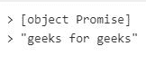
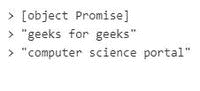
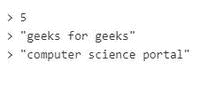

# JavaScript Promise 构造函数

> 原文：`https://www.geeksforgeeks.org/javascript-promise-constructor/`

JavaScript `Promise` 用于处理 JavaScript 中的异步操作。当处理多个异步操作时，它们很容易管理，其中回调会创建回调地狱，导致无法管理的代码。

`Promise` 构造函数主要用于包装已经不支持 `Promise` 的函数。

**语法：**

```
new Promise(executor)
```

**参数：**

*   `executor`：执行者可以是将结果与承诺联系起来的自定义代码。你，程序员，写遗嘱执行人。

**返回值：** 另一个 `Promise` 对象，在这种情况下，承诺被动态插入到链中。

### 示例1：仅创建一个Promise构造函数

```html
<script>
// Creating an new promise and resolving geeks for geeks
const promise1 = new Promise((resolve, reject) => {
  setTimeout(() => {
    resolve('geeks for geeks');
  }, 100);
});

promise1.then((value) => {
  console.log(value);
 // output will be : geeks for geeks
});

// output will be : [object Promise]
console.log(promise1);
</script>
```

**输出：**



### 示例2：创建两个Promise构造函数

在这段代码中，我们将创建两个承诺构造函数。

```html
<script>
// Creating first promise constructor
const promise1 = new Promise((resolve, reject) => {
  setTimeout(() => {
    resolve('geeks for geeks');
  }, 100);
});

////creating second promise constructor
const promise2 = new Promise((resolve, reject) => {
  setTimeout(() => {
    resolve('computer science portal');
  }, 100);
});

promise2.then((value) => {
  console.log(value);
  // output: "computer science portal"
});

promise1.then((value) => {
  console.log(value);
  //  output: "geeks for geeks"
});
console.log(promise1);
// output: [object Promise]
</script>
```

**输出：**



### 示例3：显示值

```html
<script>// Creating first promise constructor
const promise1 = new Promise((resolve, reject) => {
  setTimeout(() => {
    resolve('geeks for geeks');
  }, 100);
});

// Creating second promise constructor
const promise2 = new Promise((resolve, reject) => {
  setTimeout(() => {
    resolve('computer science portal');
  }, 100);
});

promise2.then((value) => {
  console.log(value);
  // output: "computer science portal"
});

promise1.then((value) => {
  console.log(value);
  //  output: "geeks for geeks"
});
console.log(2+3);
// output: [object Promise]
</script>
```

**输出：**

