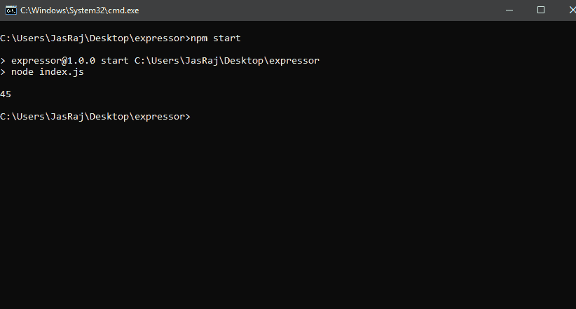
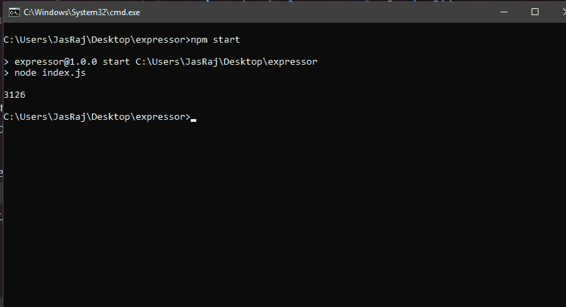

# JavaScript Promise.resolve()方法

> 原文: [https://www.geeksforgeeks.org/javascript-promise-resolve-method/](https://www.geeksforgeeks.org/javascript-promise-resolve-method/)

[Promise](https://www.geeksforgeeks.org/javascript-promises/)是表示用户任务完成或失败的对象。JavaScript 中的 Promise 可以处于三种状态：待定、履行或拒绝。
在 JavaScript 中使用 `Promise` 的主要优点是，在 `Promise` 被拒绝或实现的情况下，用户可以为 `Promise` 分配回调函数。顾名思义，Promise 要么被遵守，要么被打破。所以，一个 Promise 要么被完成（遵守），要么被拒绝（违背）。

## Promise resolve()方法

JS 中的 `Promise.resolve()` 方法返回一个 `Promise` 对象，用给定值解析。三种情况中的任何一种都可能发生：

*   如果该值是一个 `Promise`，那么该 `Promise` 将被返回。
*   如果该值有一个 `then` 附加到 `Promise`，那么返回的 `Promise` 将跟随那个 `then` 直到最后状态。
*   用它的价值履行的 `Promise` 将被归还。

### 语法

```
Promise.resolve(value);
```

### 参数

此 `Promise` 要解析的值。

### 返回值

要么用其价值兑现承诺的 `Promise` 被返还。

### 示例

#### JavaScript

```javascript
var promise = Promise.resolve(17468);

promise.then(function(val) {
    console.log(val);
});
//Output: 17468
```

#### 输出

```
17468
```

#### 解析数组

##### JavaScript

```javascript
const promise = new Promise((resolve, reject) => {
    setTimeout(() => {
        resolve([89, 45, 323]);
    }, 5000);
});

promise.then(values => {
    console.log(values[1]);
});
```

#### 输出

```
45
```



#### 解析另一个承诺

##### JavaScript

```javascript
const promise = Promise.resolve(3126);

const promise1 = new Promise((resolve, reject) => {
    setTimeout(() => {
        promise.then(val => console.log(val));
    }, 5000);
});

promise1.then(vals => {
    console.log(vals);
});
```

#### 输出

```
3126
```



### 支持的浏览器

*   Google Chrome 6.0 及以上版本
*   Internet Explorer 9.0 及以上版本
*   Mozilla 4.0 及以上版本
*   Opera 11.1 及以上
*   Safari 5.0 及以上版本

JavaScript 最出名的是网页开发，但它也用于各种非浏览器环境。您可以通过以下 [JavaScript 教程](https://www.geeksforgeeks.org/javascript-tutorial/)和 [JavaScript 示例](https://www.geeksforgeeks.org/javascript-examples/)从头开始学习 JavaScript。